# Evidências
Dei início ao meu projeto no VSCode vinculando-o ao meu repositório utilizando os comandos que são exibidos no GitHub ao criá-lo:

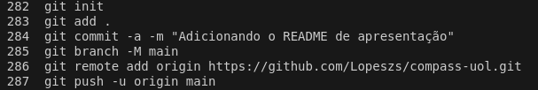  
[Evidencia 1](evidencias/evidencia_1.webp)  
  
Na pasta do projeto estava o arquivo README.md de apresentação e ele imediatamente foi upado no GitHub:

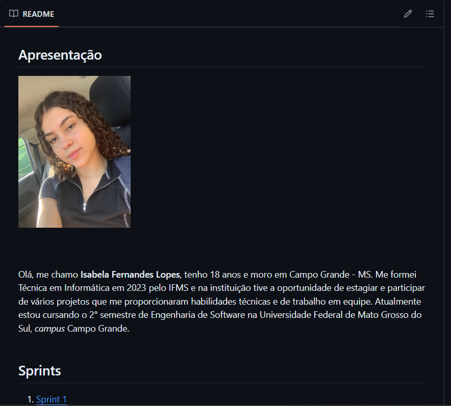  
[Evidencia 2](evidencias/evidencia_2.webp)  
link para o repositório: https://github.com/Lopeszs/compass-uol.git
  

Com o repositório já vinculado ao VSCode, dei inicio a Etapa 4.1 do Desafio Final, criei o arquivo processamento_de_vendas.sh e segui as instruções passadas no slide do desafio utilizando os comandos que aprendi no curso de Linux da Udemy juntamente com informações sobre shell que obti assistindo as aulas de um curso de Shell também da plataforma Udemy:

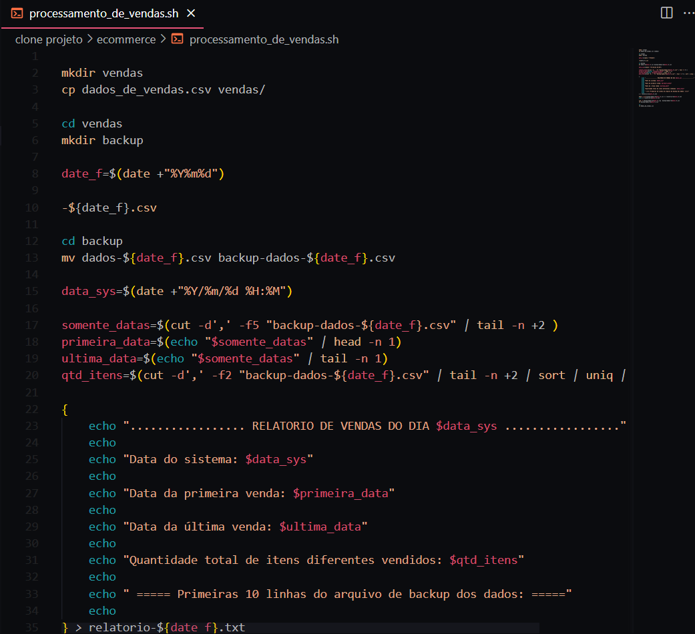  
[Evidencia 3](evidencias/evidencia_3.webp)
  

Para executar o arquivo sem problemas, dei a permissão necessária utilizando o comando chmod e executei o arquivo usando ./processamento_de_vendas.sh:

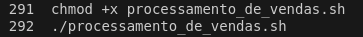  
[Evidencia 4](evidencias/evidencia_4.webp)
  

O executável funcionou corretamente após alguns ajustes nos scripts. Todos os requisitos da etapa como a criação dos diretórios, cópias dos arquivos, compactação do arquivo dos dados e o relatório estavam conforme o solicitado no desafio, como na imagem a seguir:

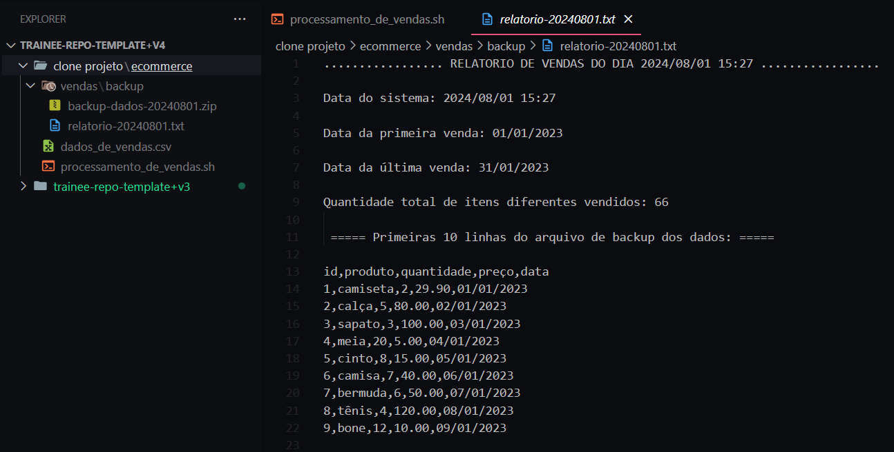  
[Evidencia 5](evidencias/evidencia_5.webp)
  

Decidi fazer um commit do projeto para enviar o progresso do desafio até então, e o código foi enviado ao GitHub:

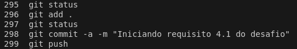  
[Evidencia 6](evidencias/evidencia_6.webp)

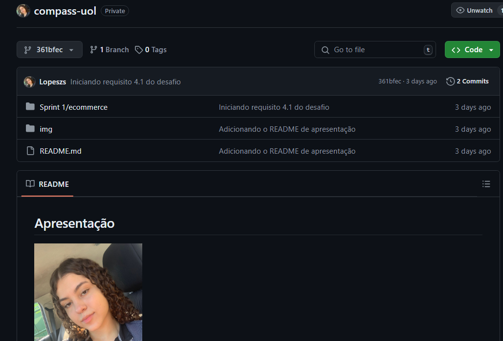  
[Evidencia 7](evidencias/evidencia_7.webp)
  

Com a etapa 4.1 finalizada, decidi comentar as linhas de código do arquivo executável para melhor compreensão de terceiros do que está sendo feito e commitei também essas mudanças:

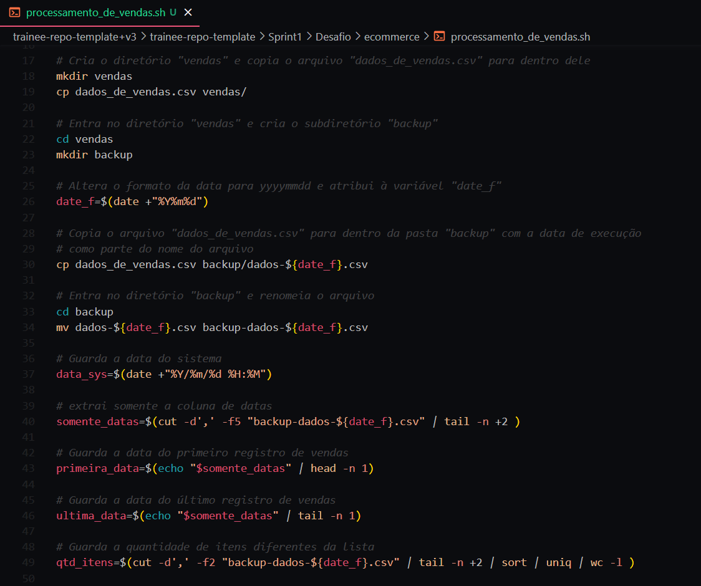  
[Evidencia 8](evidencias/evidencia_8.webp)  
Código fonte: [Desafio/ecommerce/processamento_de_vendas.sh](Desafio/ecommerce/processamento_de_vendas.sh)
  

Iniciada a etapa 4.2 do desafio, fiz o agendamento do arquivo prcessamento_de_vendas.sh para executar todos os dias as 15:27 usando o comando crontab-e e inserindo o Script abaixo:

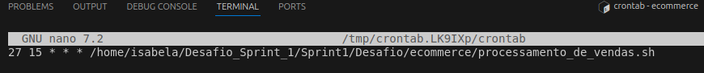  
[Evidencia 9](evidencias/evidencia_9.webp)
  

Testei o agendamento várias vezes para garantir que estava funcionando. Assim que a etapa 4.2 ficou pronta, dei um commit no projeto e parti para a última etapa. Criei o arquivo executável consolidador_de_processamento_de_vendas.sh e codifiquei o script responsável por unir todos os relatórios gerados em um relatório final:

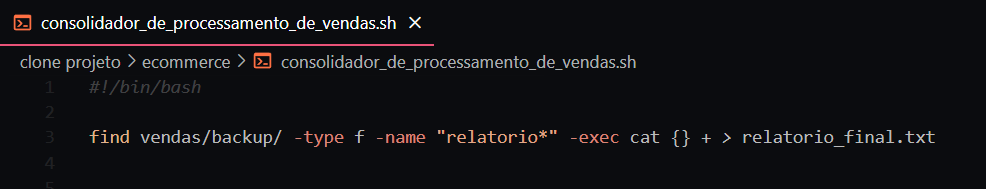  
[Evidencia 10](evidencias/evidencia_10.webp)  
  

Verifiquei que estava tudo certo conforme as instruções do slide e novamente decidi comentar as linhas de código, agora da etapa 4.3:

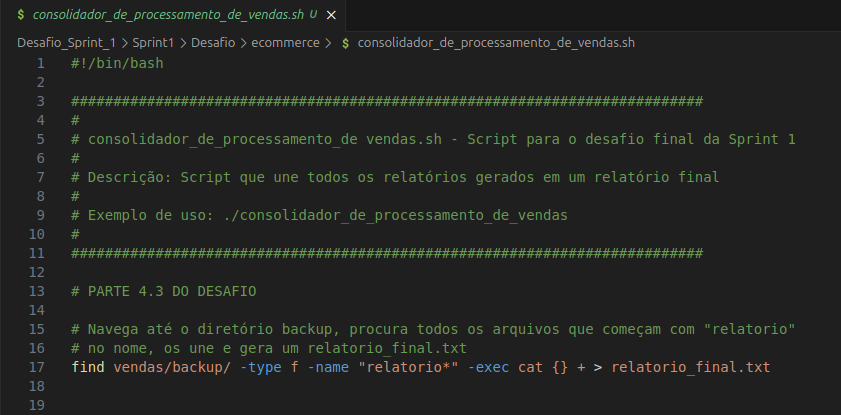  
[Evidencia 11](evidencias/evidencia_11.webp)  
Código fonte: [Desafio/ecommerce/consolidador_de_processamento_de_vendas.sh](Desafio/ecommerce/consolidador_de_processamento_de_vendas.sh)
  

O arquivo deve ser executado manualmente, portanto não precisou de agendamento, apenas do comando ./consolidador_de_processamento_de_vendas.sh no próprio terminal. Executei o arquivo e verifiquei se o relatório final estava sendo gerado corretamente (exemplo gerado após dois relatórios gerados pelo agendamento):

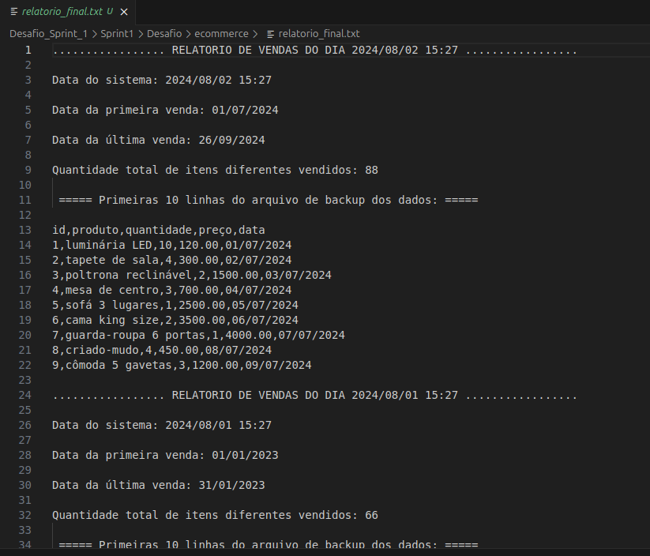  
[Evidencia 12](evidencias/evidencia_12.webp)
  

Com os códigos do desafio finalizado, commitei as mudanças feitas para registrar que completei todas as etapas e upei tudo no GitHub:

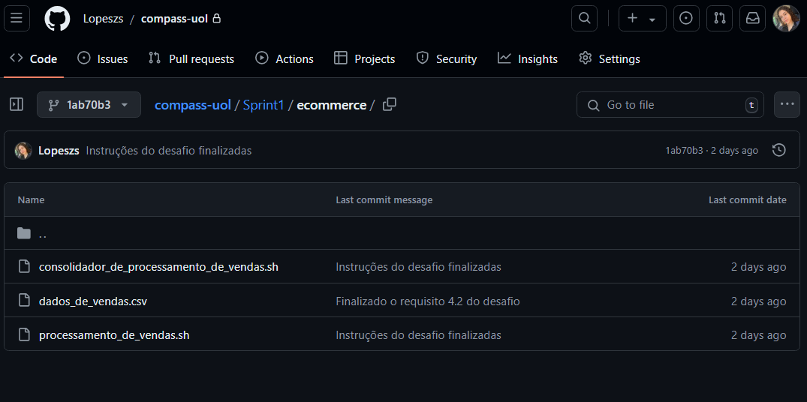  
[Evidencia 13](evidencias/evidencia_13.webp)
  

Deixei o meu código gerar os relatórios automaticamente durante 3 dias as 15:27, apenas mudei os dados do arquivo dados_de_vendas.csv em cada dia e obtive um resultado satisfatório, todos os relatórios foram gerados corretamente, Por fim executei manualmente o arquivo consolidador_de_processamento_de_vendas.sh e obtive o resultado abaixo:

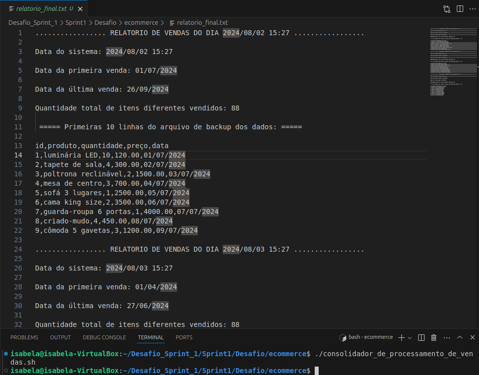  
[Evidencia 14](evidencias/evidencia_14.webp)
  

Com o desafio completamente finalizado, parti para a gravação do vídeo e mandei tudo para a avaliação.
