# Etapas

1. Etapa 1:  
[Arquivo CSV](DADOS_ABERTOS_PRODUTO_FUMIGENO.csv)  
[Script Python](query_s3.py)  
[Resultado da Consulta](CONSULTA_DADOS_ABERTOS_PRODUTO_FUMIGENO.csv)
  

Para iniciar o desafio, criei um bucket no serviço S3 da AWS com o nome "bucket-sprint5-anvisa", utilizando as configurações padrão:

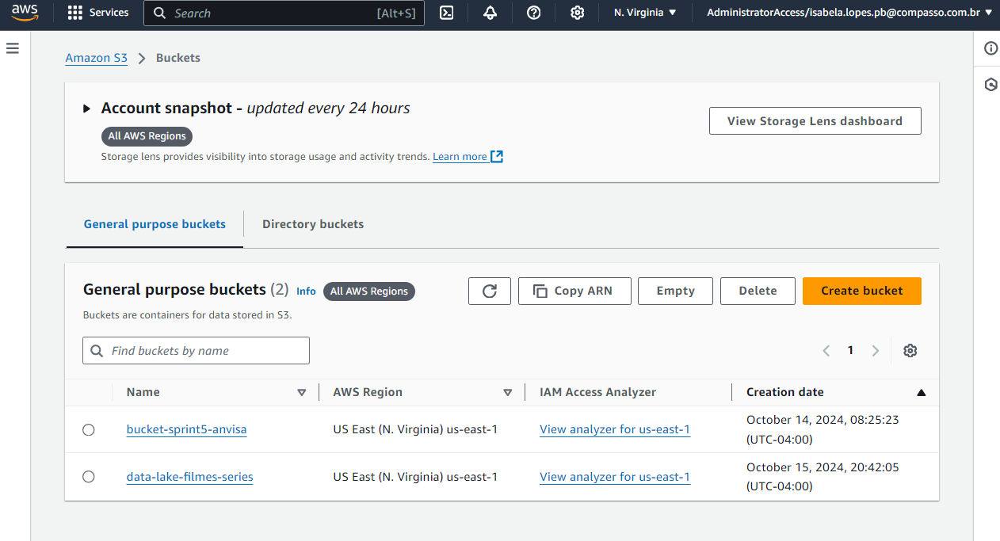  

Com o bucket criado, acessei o portal de dados abertos do Governo Federal e busquei por uma base de dados estruturada. Escolhi o conjunto de dados sobre Produtos Fumígenos Registrados no Brasil, que contém informações de produtos relacionados ao tabaco registrados pela Agência Nacional de Vigilância Sanitária (ANVISA). O registro desses produtos é obrigatório para a comercialização legal no Brasil: 

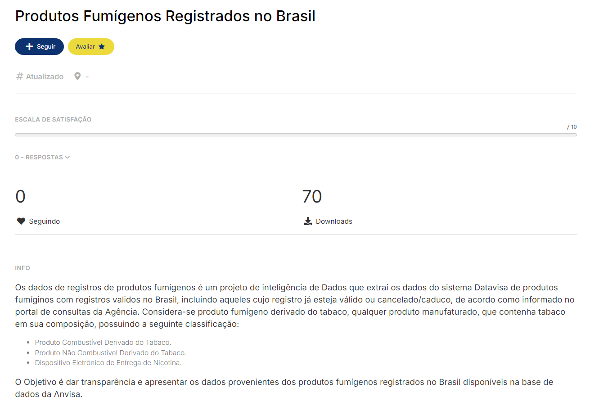
O arquivo CSV conta com dados como:
- NU_CNPJ_EMPRESA: Número do CNPJ da empresa responsável pelo produto fumígeno.
- NO_RAZAO_SOCIAL_EMPRESA: Razão social da empresa que produz ou comercializa o produto.
- NO_PRODUTO: Nome comercial do produto fumígeno registrado.
- NU_PROCESSO: Número do processo de registro do produto na ANVISA.
- DS_TIPO_PRODUTO: Descrição do tipo de produto fumígeno (por exemplo, cigarros, charutos, etc.).
- DS_CATEGORIA_PRODUTO: Categoria do produto fumígeno, especificando mais detalhes sobre o tipo de produto.
- DT_VENCIMENTO_REGISTRO: Data de vencimento do registro do produto. Esse dado é importante para verificar se o produto ainda pode ser comercializado.
- ST_SITUACAO_REGISTRO: Situação atual do registro, como "Ativo" ou "Inativo", indicando se o produto está ou não autorizado para comercialização no país.

O arquivo pode ser consultado aqui: [Arquivo CSV](COLSULTA_DADOS_ABERTOS_PRODUTO_FUMIGENO.csv)  

Após escolher o conjunto de dados, criei um script Python e importei as bibliotecas necessárias, como pandas e boto3, além de bibliotecas para acessar minha conta AWS. Também criei um arquivo .env onde as chaves de acesso foram configuradas como variáveis de ambiente. Utilizei essas variáveis de ambiente para criar um cliente do serviço S3 usando o boto3.client:

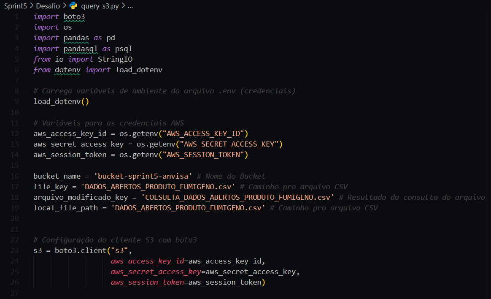  

Para carregar o arquivo CSV no bucket S3 utilizando boto3, criei uma função que recebe como parâmetros o caminho do arquivo, o nome do bucket e o caminho onde o arquivo será armazenado dentro do bucket. O upload é realizado com o método s3.upload_file() da biblioteca boto3:

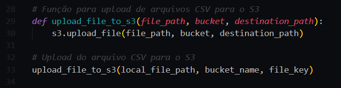  

Ao testar a função, o arquivo CSV foi carregado com sucesso no bucket:
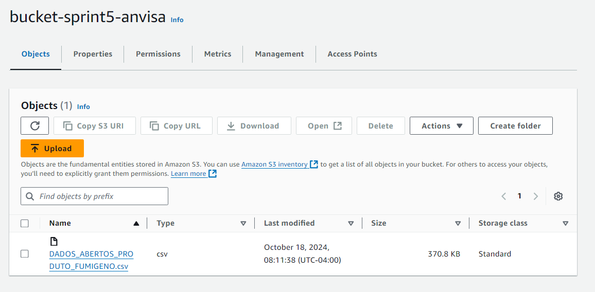  

Após enviar o arquivo para o S3, precisei baixá-lo para realizar a consulta SQL. Para isso, criei uma função que baixa e carrega o arquivo CSV armazenado no S3 utilizando o método get_object do boto3:

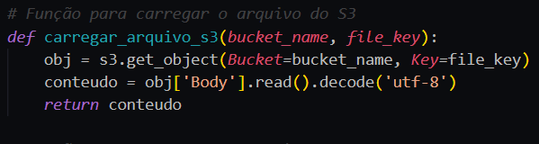  

Em seguida, criei a consulta SQL necessária para o desafio, contendo todas as funções solicitadas. A consulta é executada no DataFrame df, que contém os dados dos produtos fumígenos, utilizando a biblioteca pandasql para realizar consultas SQL diretamente no DataFrame do pandas:

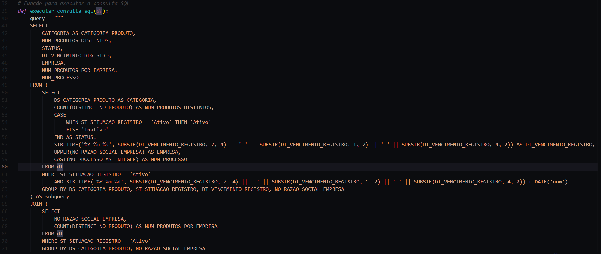
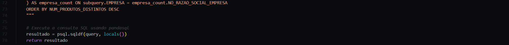  

Utilizei o Amazon S3 Select para verificar se o resultado da consulta estava correto e ajustei a query conforme necessário, executando o script Python até obter o resultado correto:

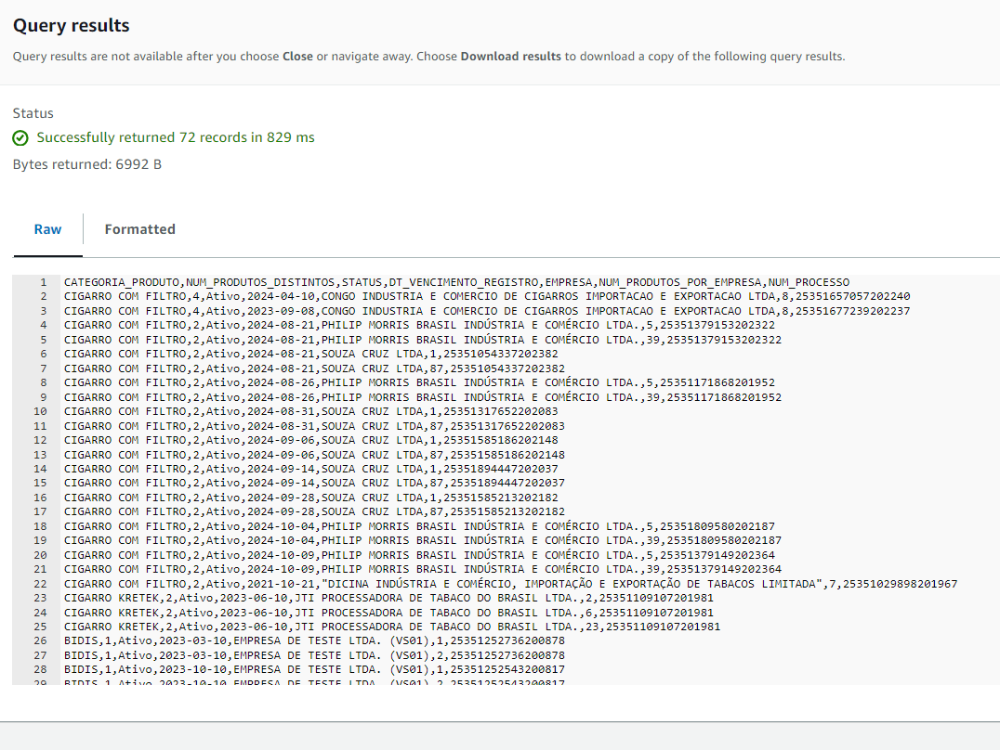  

Depois de obter o resultado esperado, criei uma função para converter o DataFrame em CSV e fazer o upload do arquivo diretamente para o bucket S3, sem a necessidade de salvar o CSV localmente. Para isso, utilizei o buffer de memória (StringIO) para facilitar o upload:

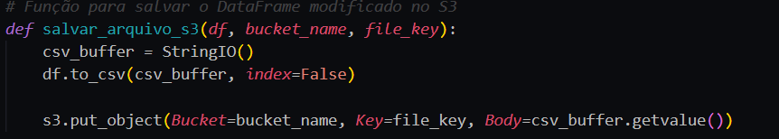  

Por fim, fiz as chamadas das funções ao final do código, passando todos os parâmetros necessários para realizar o upload do arquivo CSV para o bucket e carregar o arquivo para realizar a consulta SQL:

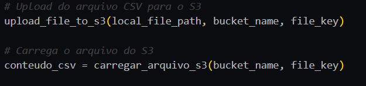  

Criei o DataFrame com os dados e executei as funções para realizar a consulta e salvar o resultado no S3:

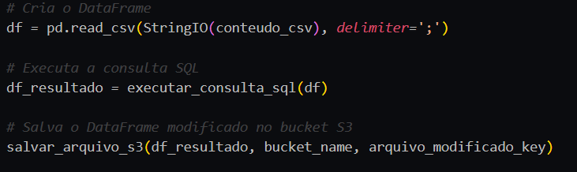  

Ao executar o script Python, tanto o arquivo CSV original quanto o resultado da consulta foram carregados com sucesso no bucket S3:
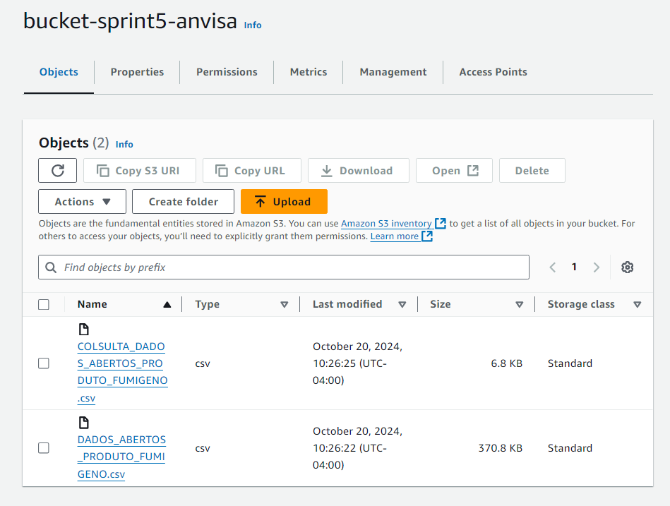  

