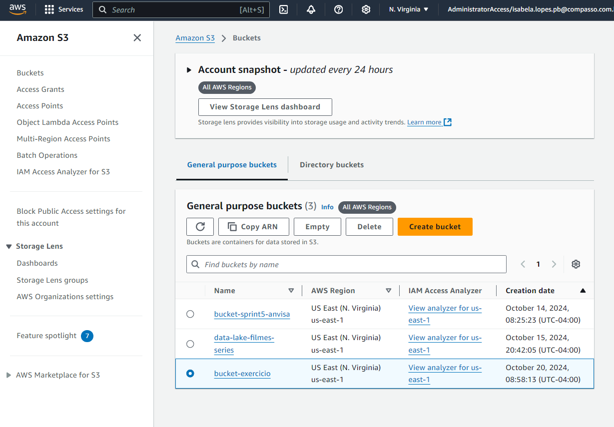
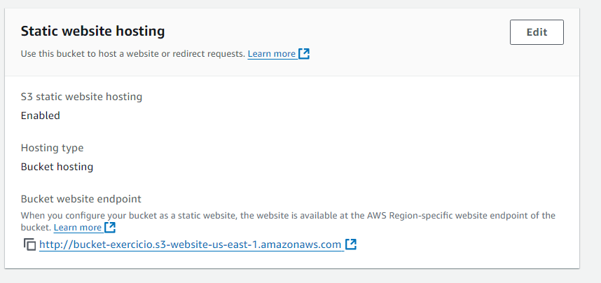
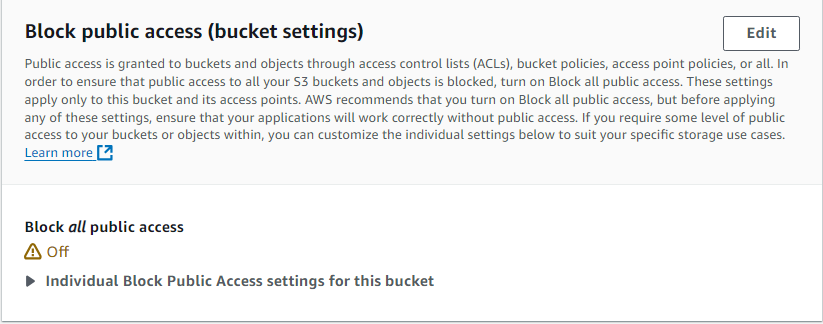
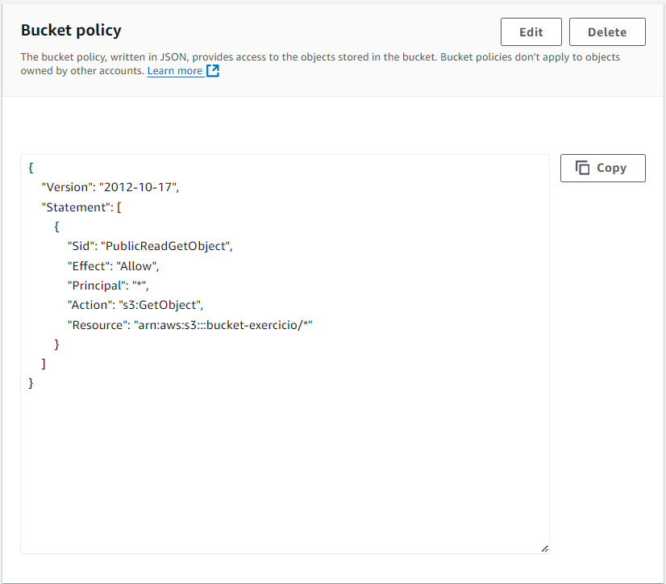
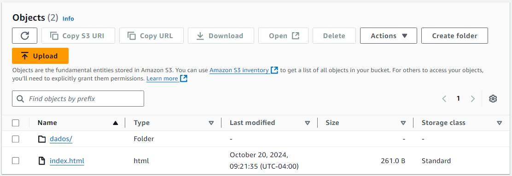
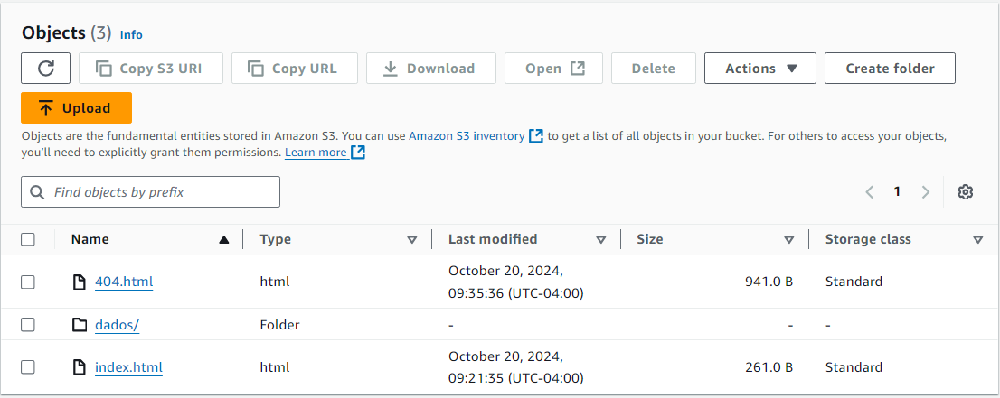
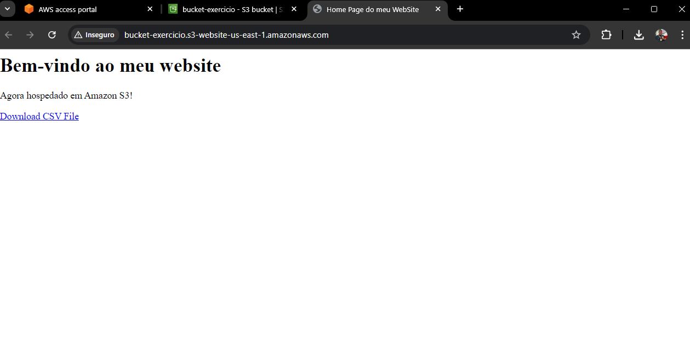
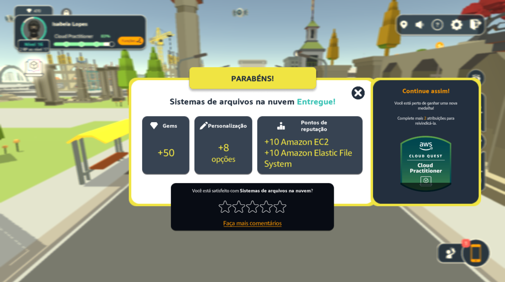
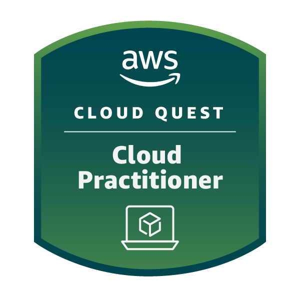
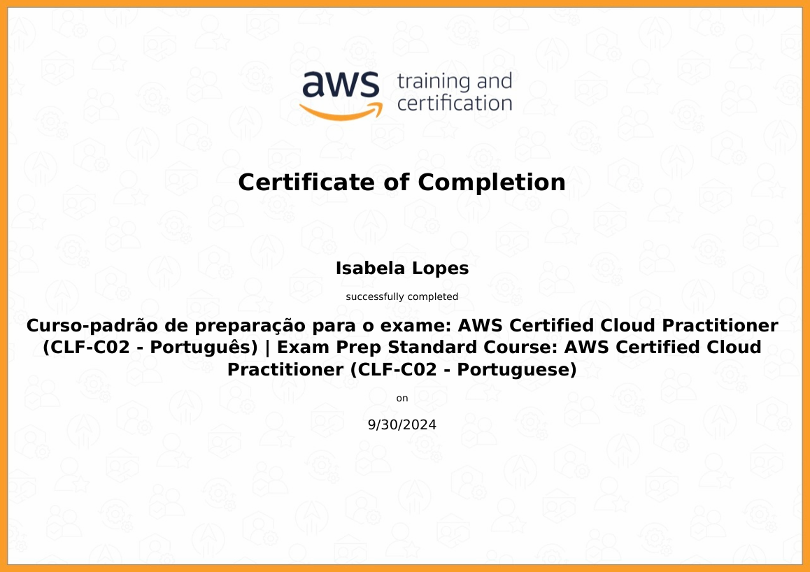

# Exercícios

### Etapa 1: Criar um bucket
  

### Etapa 2: Habilitar hospedagem de site estático
  

### Etapa 3: Editar as configurações do Bloqueio de acesso público
  

### Etapa 4: Adicionar política de bucket que torna o conteúdo do bucket publicamente disponível
  

### Etapa 5: Configurar um documento de índice
  

### Etapa 6: Configurar documento de erros
  

### Etapa 7: Testar o endpoint do site
  

# Evidências

### Game AWS Cloud Practitioner
No jogo da AWS, explorei uma variedade de casos de uso dos recursos disponíveis, aplicando soluções da AWS para resolver problemas do mundo real. Após a realização de algumas das tarefas, fiz alguns registros:  

#### Entrega da tarefa "Banco de dados na prática"
Nesta tarefa, aprendi sobre a criação e gerenciamento de bancos de dados na AWS, incluindo a utilização do Amazon RDS para configurar um banco de dados relacional. A atividade envolveu a implementação de práticas recomendadas para segurança e otimização de desempenho.
  

#### Entrega da tarefa "Conceitos básicos de segurança"
A tarefa focou em princípios fundamentais de segurança na nuvem, incluindo controle de acesso, criptografia e melhores práticas para proteger dados e recursos na AWS. Explorei o AWS Identity and Access Management (IAM) e como configurar políticas de segurança.
  

#### Entrega da tarefa "Primeiro banco de dados no SQL"
Nesta atividade, tive a oportunidade de criar meu primeiro banco de dados SQL na AWS. Aprendi a executar consultas básicas, inserir dados e fazer alterações em registros utilizando o Amazon RDS.
  

#### Entrega da tarefa "Sistemas de arquivo na nuvem"
Explorei as opções de armazenamento na nuvem, com foco no Amazon S3. Aprendi a gerenciar objetos, configurar buckets e aplicar políticas de acesso para garantir a segurança dos dados armazenados.
  

#### Entrega da tarefa "Aplicações de recuperação automática e com escalabilidade"
Nesta tarefa, trabalhei com a configuração de aplicações que podem se recuperar automaticamente de falhas e escalar conforme a demanda. Estudei o uso do Auto Scaling e Elastic Load Balancing para melhorar a disponibilidade e a resiliência das aplicações.
  

#### Entrega da tarefa "Aplicativos web de alta disponibilidade"
Aprendi a projetar e implementar aplicações web que garantem alta disponibilidade e performance. Explorei a arquitetura de microserviços e como usar serviços como AWS Lambda e Amazon API Gateway para construir aplicações escaláveis.
  

### Game concluído
Após concluir todas as tarefas, finalizei o jogo com uma compreensão sólida dos principais conceitos e serviços da AWS.
  

### Emblema Cloud Practitioner recebido
Ao completar o curso, recebi o emblema Cloud Practitioner:
  

# Certificados

- AWS Cloud Quest: Cloud Practitioner
  

- AWS Certified Cloud Practitioner
  

