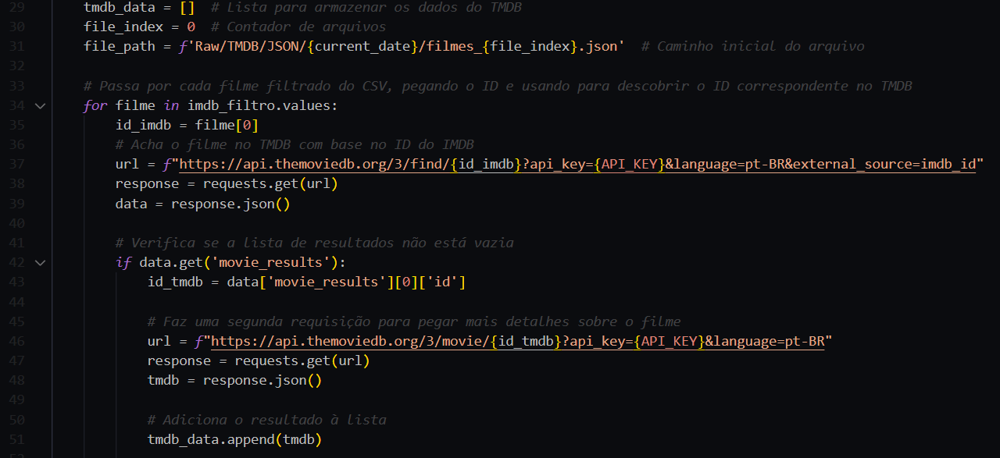
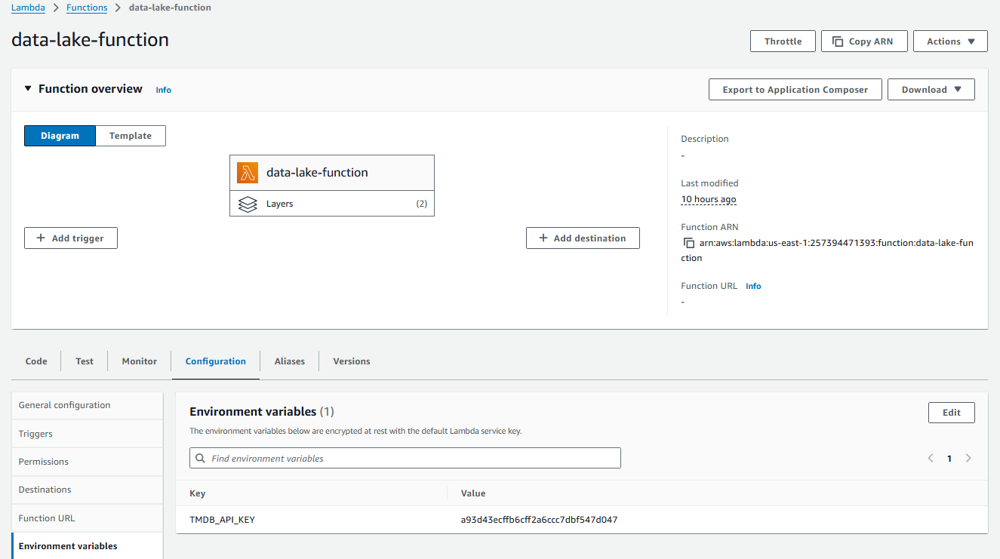
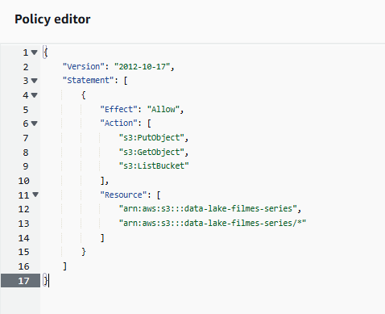
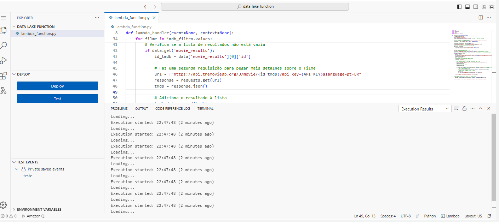
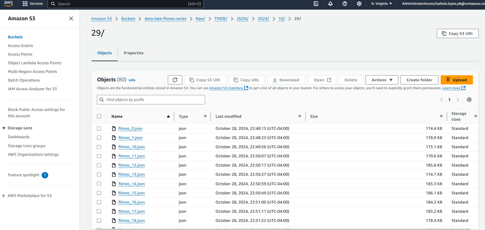
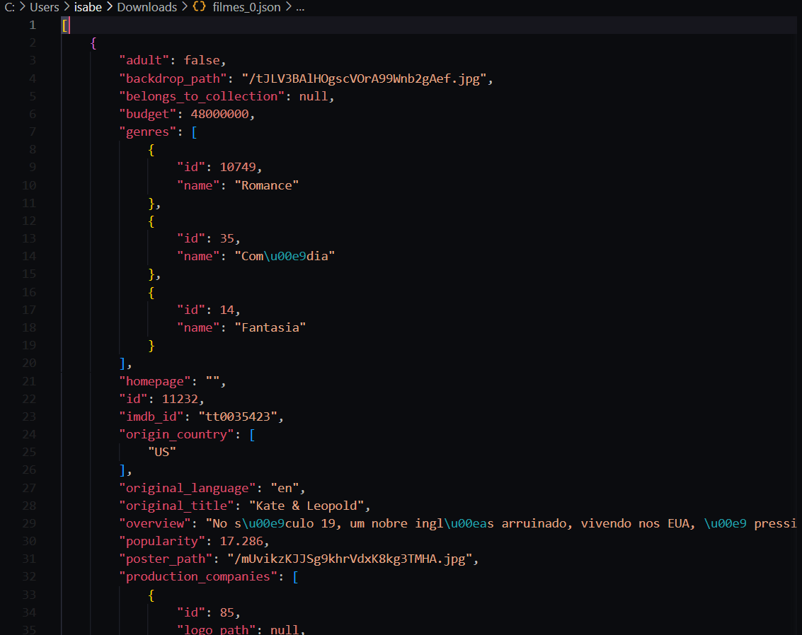

Para iniciar o desafio, desenvolvi um script em Python para realizar testes localmente, antes de enviar para o serviço Lambda da AWS. O código pode ser verificado [aqui](filmes-series-2.py)

No script, importei pacotes como json, requests, pandas, boto3, os e datetime, essenciais para a manipulação de dados, comunicação com a API TMDB, acesso ao S3 e processamento de datas:

  

Em seguida, defini a função principal lambda_handler, usada pelo AWS Lambda como ponto de entrada, e inicializei o cliente do S3 para interagir com o Amazon S3. Também defini variáveis contendo o nome do bucket para armazenamento dos dados e a chave de API do TMDB, a qual configurei nas variáveis de ambiente:

  

Para organizar os dados no S3, configurei uma variável que armazena a data atual no formato "YYYY/MM/DD". Depois, utilizei o cliente S3 para ler o arquivo CSV "movies.csv", armazenado no bucket, e carreguei-o em um DataFrame do pandas. Para garantir a consistência dos dados, removi duplicatas com base no ID dos filmes e substituí valores inválidos na coluna de ano de lançamento.

  

A partir daí, filtrei o DataFrame para selecionar apenas filmes de comédia lançados a partir de 1990:

  

Com os dados filtrados, iniciei um loop para buscar informações adicionais na API do TMDB, usando o ID IMDB de cada filme. O processo faz uma primeira chamada à API para localizar o filme no TMDB e, se encontrado, uma segunda chamada para obter detalhes adicionais. Armazenei esses detalhes em uma lista chamada tmdb_data:

  

Durante o loop, defini um limite para o arquivo JSON no S3, de forma que ele não ultrapassasse 100 registros ou 10 MB. Quando esses limites eram atingidos, os dados acumulados eram gravados como um arquivo JSON no bucket S3, e a lista era reiniciada para um novo arquivo, gerenciando múltiplos arquivos JSON quando necessário:

  

Ao final do processo, gravei quaisquer dados restantes no S3 e retornei uma resposta de sucesso:

  

Com o script finalizado, criei uma função no AWS Lambda e configurei a chave de API do TMDB como uma variável de ambiente:

  

Após isso, configurei duas layers na minha função Lambda: uma contendo a dependência pandas e outra com requests e boto3:

  

Em seguida, concedi permissões para que a função Lambda pudesse acessar o bucket S3 onde os arquivos JSON são salvos. Para isso, acessei o serviço IAM da AWS e atribuí as permissões s3:PutObject, s3:GetObject e s3:ListBucket para a role da função:

  

Além disso, aumentei o tempo máximo de execução e a quantidade de memória para a função Lambda:

  

Com tudo configurado, carreguei o código na função e executei um teste para garantir que os dados do TMDB fossem recuperados e salvos no bucket S3:

  

O resultado foi satisfatório, com os registros de filmes do gênero comédia/animação lançados a partir de 1990 sendo salvos em arquivos JSON e carregados no bucket S3:

  

Exemplo do conteúdo de um arquivo .json gerado: 

  
