O desafio consiste no desenvolvimento de dois jobs no AWS Glue para processar e padronizar dados armazenados no bucket S3. Um dos jobs foi configurado para processar arquivos CSV e o outro para arquivos JSON.

## Script para Processamento de Arquivos CSV

Para iniciar o desafio, o primeiro passo foi criar dois jobs no serviço AWS Glue: um para processar dados no formato CSV e outro para processar arquivos JSON.

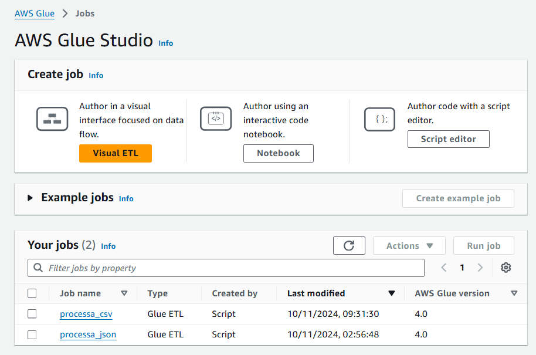  

Com os jobs criados, comecei a desenvolver o script para processar e padronizar os dados CSV contidos na camada Raw do bucket S3. O código pode ser consultado [aqui](processa_csv.py)

Iniciei o código importando as bibliotecas necessárias para o desenvolvimento do script em PySpark, além das APIs do AWS Glue, que permitem processar e transformar dados no serviço. Também foram inicializados, por padrão do job, os argumentos e o contexto:

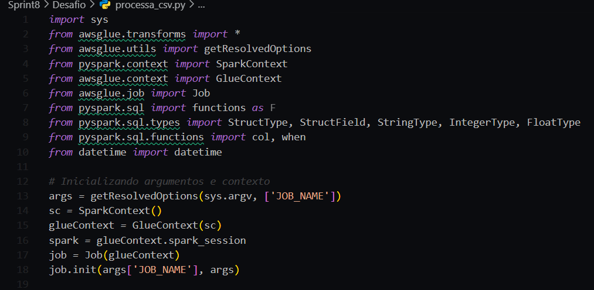  

Os caminhos de entrada e saída foram definidos de acordo com a estrutura do Data Lake. Também foi definida a estrutura dos dados com colunas e tipos, garantindo a leitura correta do CSV no formato desejado:

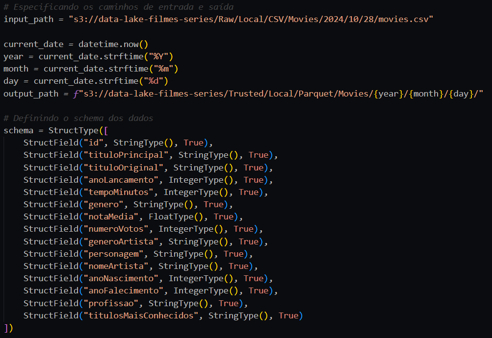  

Os dados foram carregados utilizando "|" como delimitador de colunas, e o esquema definido foi aplicado para estruturar os dados:

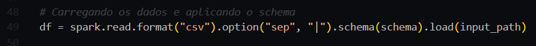  

Em seguida, os dados foram tratados. Primeiro, foram removidas as linhas duplicadas considerando uma combinação única de id e nome do artista, mantendo apenas registros exclusivos. Os valores ausentes ou nulos (\N) foram substituídos por None em todas as colunas. Por fim, os dados foram filtrados para reter apenas os filmes dos gêneros comédia ou animação, lançados após 1990:

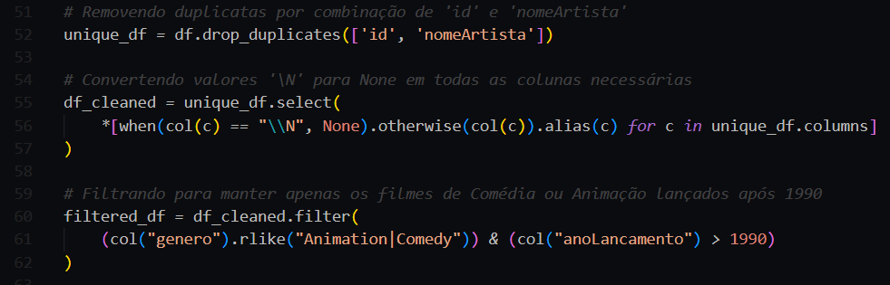  

Por último, o número de partições foi reduzido para 1, a fim de gerar um único arquivo de saída, e então o DataFrame foi gravado no bucket S3 no formato Parquet:

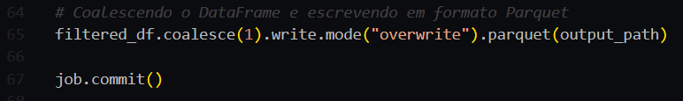  

Após alguns testes o script foi executado com sucesso no Glue e o arquivo Parquet foi persistido corretamente no bucket S3 na camada Trusted:

Job do Glue:
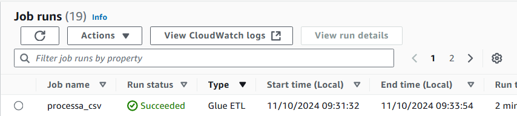

Arquivo no bucket S3:
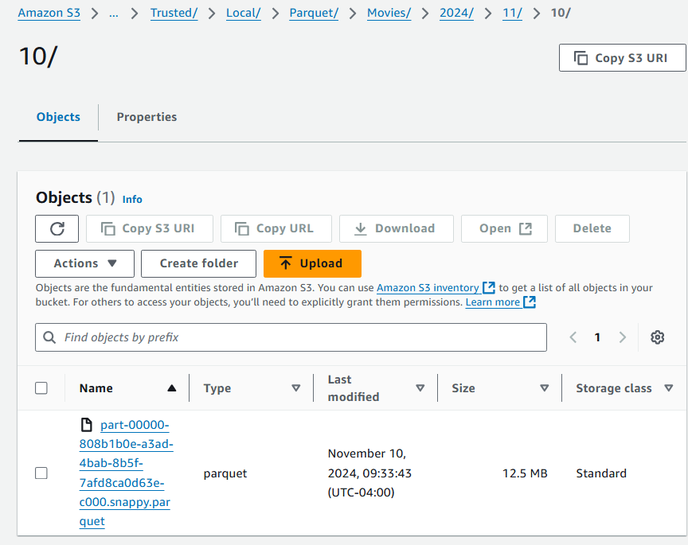  

Após concluir o processamento dos dados CSV, o próximo passo foi criar o script para processar e padronizar os dados JSON, também contidos na camada Raw do bucket S3.  

## Script para Processamento de Arquivos JSON

No script, iniciei com a importação das bibliotecas necessárias, incluindo as transformações do AWS Glue e funções do PySpark. Também foi configurado o contexto do Glue, definindo o job com os argumentos iniciais e o contexto Spark:

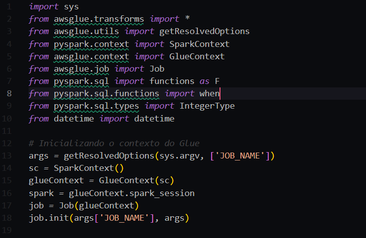  

Os caminhos de entrada e saída foram definidos de acordo com a estrutura do Data Lake e os dados JSON foram carregados com a opção multiline habilitada para facilitar a leitura de arquivos no formato JSON estruturado:

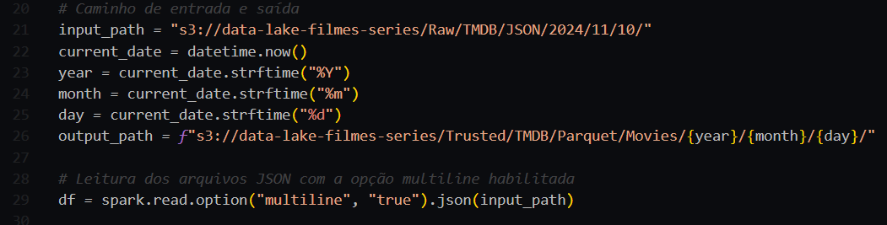  

Em seguida, os valores vazios foram transformados em nulos, garantindo uma estrutura uniforme para o processamento dos dados. E para padronizá-los foram selecionadas e transformadas colunas específicas, incluindo o id do filme, title, original_title, release_date, e outros campos relevantes para a análise que será realizada ao final da Sprint 10:

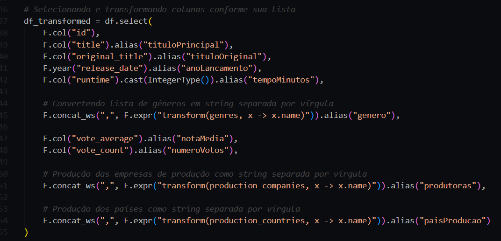  

Para garantir a consistência dos dados, foram removidos registros sem id e registros duplicados, mantendo apenas IDs únicos. Em seguida, os dados foram particionados em um único arquivo para otimizar o armazenamento e consulta, e o DataFrame final foi salvo em formato Parquet no bucket S3:

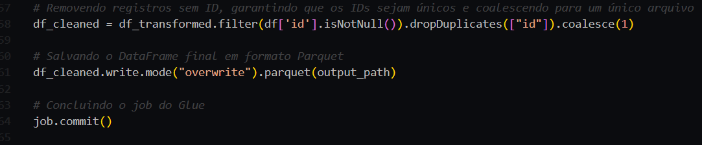  

Após alguns testes o job foi executado com sucesso no Glue e o arquivo Parquet foi persistido corretamente no bucket S3 na camada Trusted:

Job do Glue:
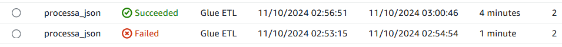

Arquivo no bucket S3:
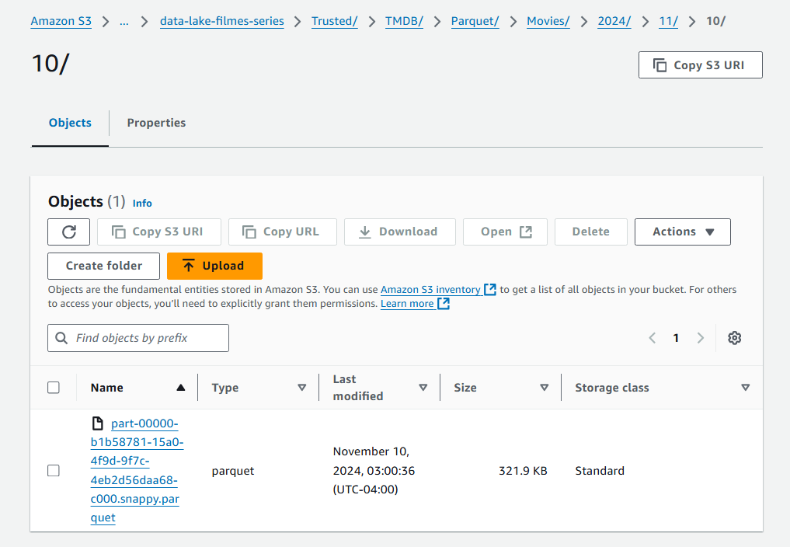  

Com os arquivos Parquet gerados, eles foram catalogados no AWS Data Catalog, possibilitando análise com o Amazon Athena.

Tabela para dados CSV:
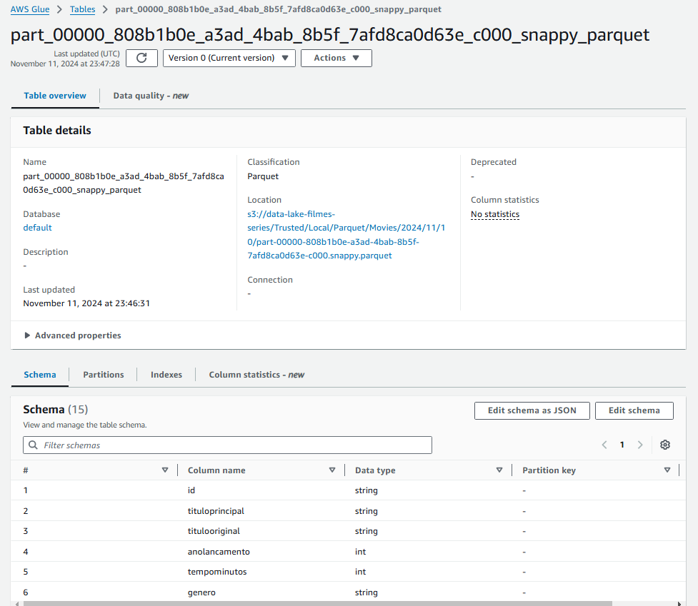  

Tabela para dados JSON:
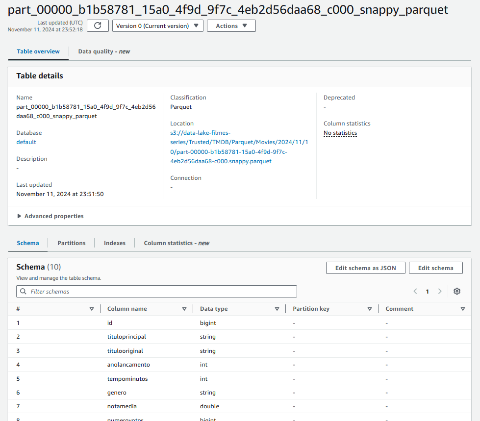  

