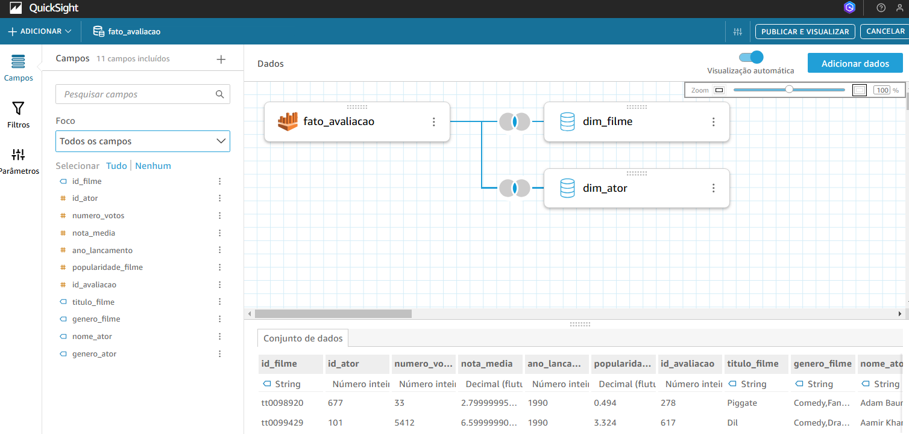
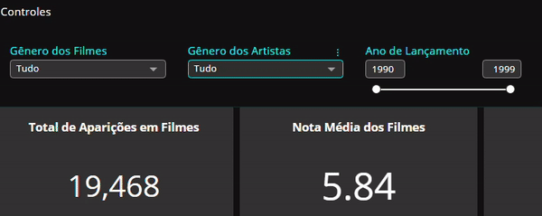
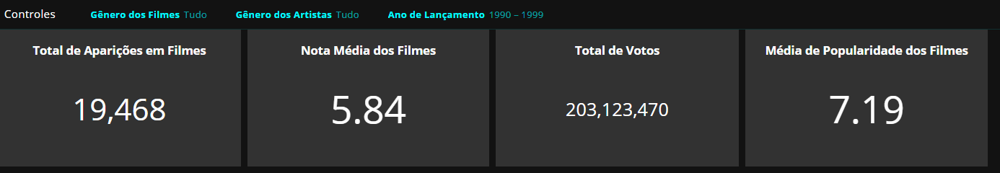
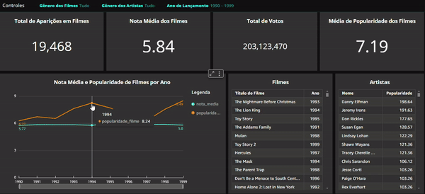
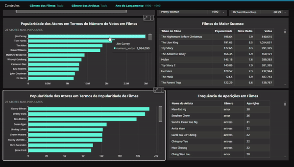

# Desafio: Análise de Popularidade de Atores em Filmes de Comédia e Animação

## Análise Proposta (Contém Alterações)
A análise realizada busca explorar a **Popularidade de Atores em Filmes de Comédia e Animação da Década de 90** e investigar como essa popularidade influencia no sucesso dos filmes.
As principais perguntas que essa análise responde são:  
- Quais são os atores com os filmes mais votados pelo público? E quais são esses filmes?
- Quais são os atores mais populares, considerando a popularidade dos filmes em que participaram?
- Com que frequência os atores aparecem em filmes de comédia e animação?

## Desenvolvimento do Desafio
Para dar início ao desafio, criei os conjuntos de dados a partir de uma tabela fato e dimensões catalogadas no Amazon Athena. As tabelas utilizadas incluem:
- fato_avaliação
- dim_filme (conectada pelo id_filme)
- dim_ator (conectada pelo id_ator)  
  

A análise foi estruturada com base na tabela fato_avaliação, realizando joins com as dimensões de filme e ator que forneceram informações detalhadas sobre os filmes e sobre os atores respectivamente. Durante a preparação dos dados para a análise, renomeei campos para melhorar a compreensão e excluí colunas desnecessárias, mantendo apenas os dados relevantes para a análise:  
  
  
Para permitir uma análise mais interativa e específica, configurei três filtros principais: 
- Filtro por Gênero de Atores -  Permite distinguir entre atores e atrizes.
- Filtro por Gênero de Filmes - Exclusivamente comédia ou animação.
- Filtro por Intervalos de Ano de Lançamento - Para ajustar o escopo da análise.  
  
  
No topo do dashboard adicionei quatro KPIs para fornecer um resumo dinâmico e filtrável:
- Total de Aparições em Filmes
- Nota Média dos Filmes
- Total de Votos Recebidos
- Média de Popularidade dos Filmes  

Esses indicadores são impactados por qualquer interação nos filtros ou gráficos.  
  
  
Adicionei um gráfico de linha ao dashboard que compara a evolução da popularidade dos filmes com a nota média dos filmes ao longo dos anos. Ele permite filtragem por ano que inclui dois gráficos adicionais em tabela que mostram:
- Filmes mais populares lançados no ano selecionado.
- Atores mais populares do mesmo período.  
  

Também incluí dois gráficos de barras:
- Um para visualizar a popularidade dos atores com base no número de votos dos filmes.
- Outro para analisar a popularidade dos atores com base na métrica de popularidade dos filmes.

Ambos possuem filtros que impactam:
- Uma tabela com a frequência de aparições dos atores em filmes.
- Uma tabela que lista os filmes de maior sucesso do ator selecionado.  
  