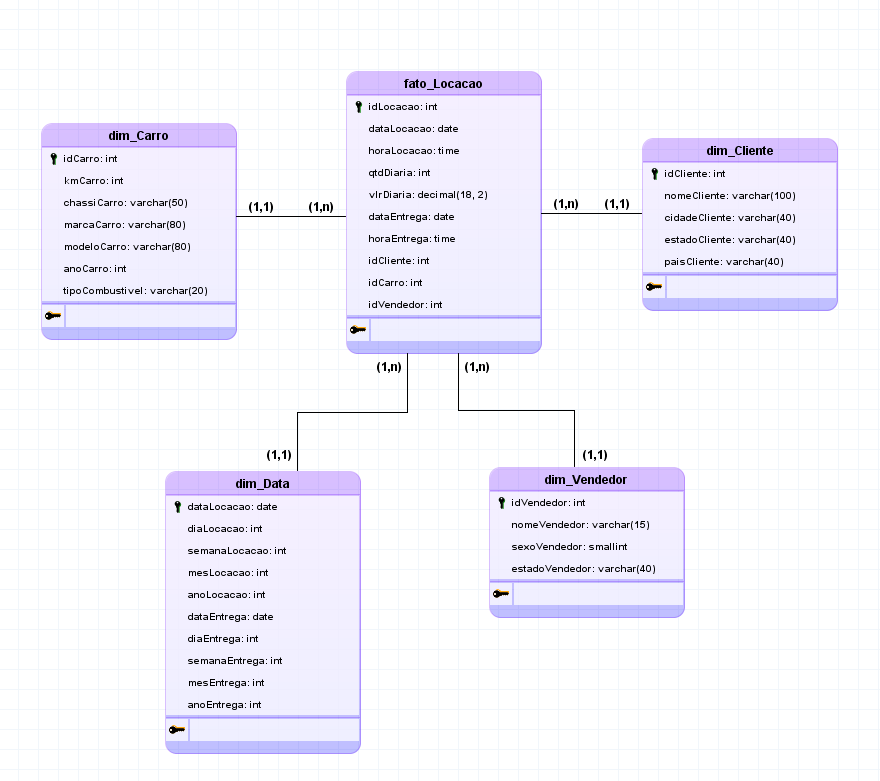
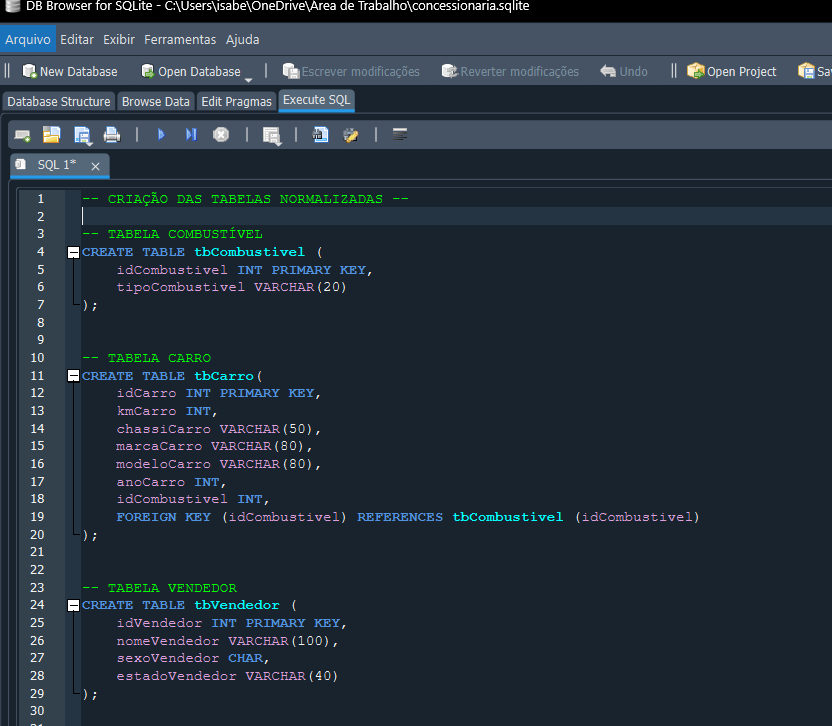
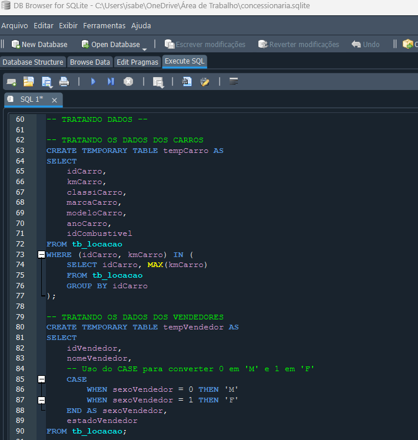
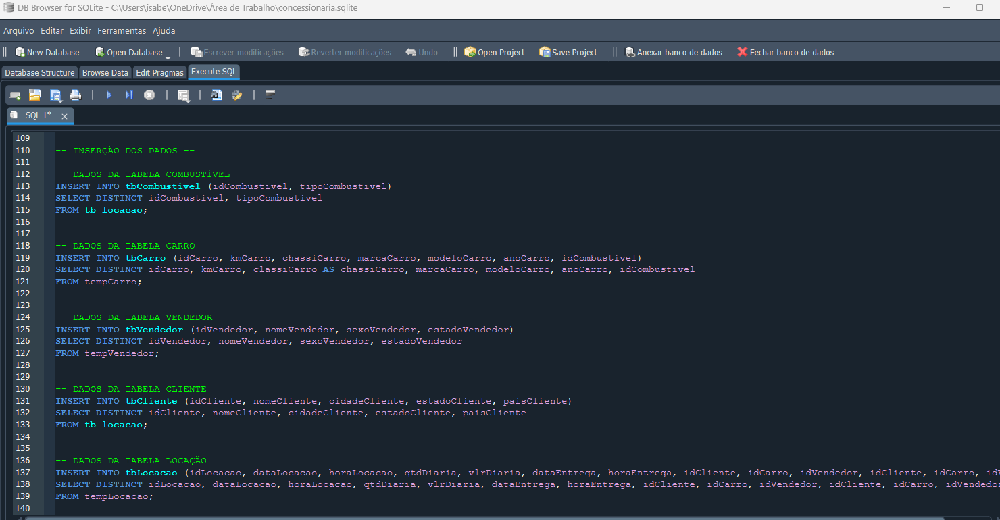
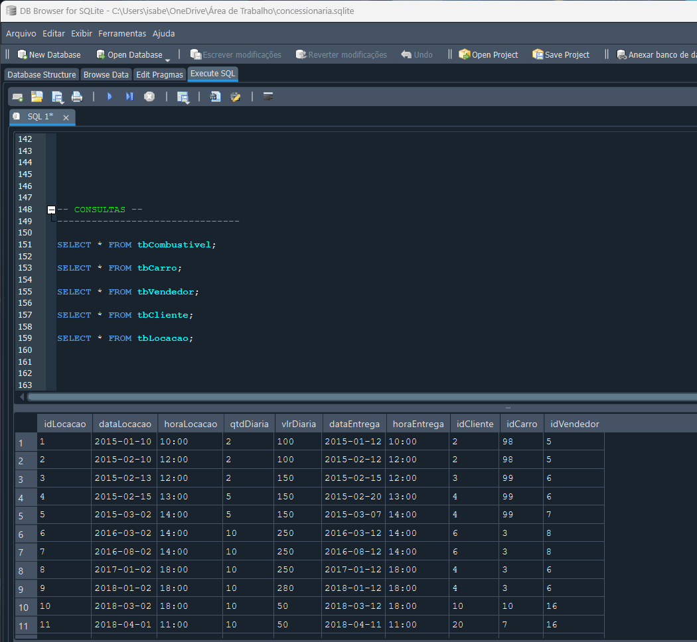
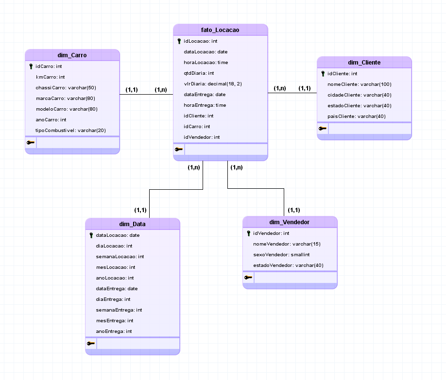
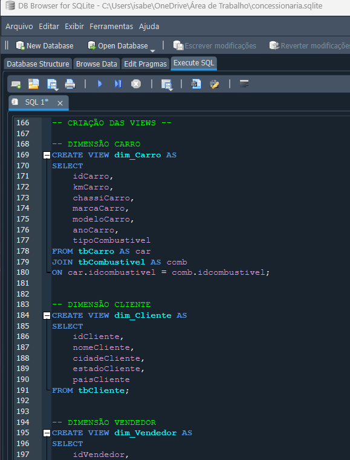
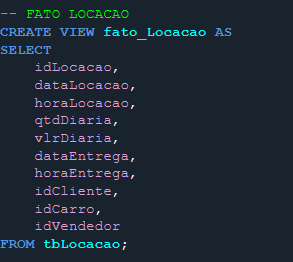
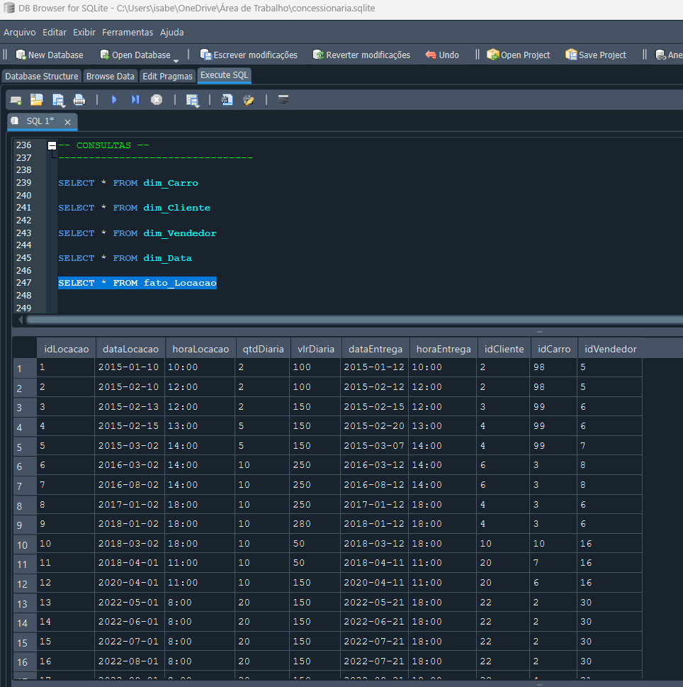

# Evidências
Iniciei o desafio normalizando a tabela tb_locacao de uma concessionária na modelagem lógica, para posteriormente passá-la para a forma física. Utilizei o aplicativo BrModelo para fazer as modelagens lógicas Relacional e Dimensional. 

Para deixar a tabela na primeira forma normal não foi preciso alterações, pois ela já foi dada na 1FN, cada campo possui um único valor atômico e não há atributos multivalorados ou compostos.

Já para deixar a tabela na segunda forma normal, identifiquei todos os atributos que não dependem da chave primária da tabela (idLocacao) e criei novas entidades para eles, assim, criei as entidades: tbCliente, tbCarro, tbCombustivel e tbVendedor. Após criadas as novas tabelas, aloquei os atributos em suas respectivas tabelas e identifiquei em cada uma a chave primária, de modo que os atributos sejam funcionalmente dependentes dela:

  
[Evidencia 1](evidencias/evidencia_1.webp)  
  

Após isso, a relação já se encontra na terceira forma normal, todos os atributos não-chave dependem totalmente da chave primária, sem dependências transitivas. Portanto o resultado do diagrama relacional lógico é:

  
[Evidencia 1](evidencias/evidencia_1.webp)  
  

Com o modelo lógico finalizado, dei início ao modelo físico me baseando na modelagem criada, utilizei o DB Browser para abrir o arquivo .sqlite da concessionária e trabalhar com o database. O primeiro passo para fazer o banco no sql foi a criação das tabelas com seus respectivos atributos, que foram definidos na modelagem lógica. Criei as tabelas tbLocacao, tbCarro, tbCombustivel, tbVendedor e tbCliente e sinalizei as chaves primárias e estrangeiras de cada entidade:

  
[Evidencia 2](evidencias/evidencia_2.webp)  
  

Com as tabelas corretamente criadas. Identifiquei que alguns dados da tabela dada (tb_locacao) precisavam ser tratados, como por exemplo as datas não estavam sendo exibidas em formato de data ‘yyyy-mm-dd’ e os registros dos carros tinham duplicidade de id, por conta das várias quilometragens registradas para cada carro. Para tratar esses dados, foram criadas tabelas temporárias:

  
[Evidencia 3](evidencias/evidencia_3.webp)
  

Com todos os dados corretamente tratados, inseri eles em suas respectivas tabelas:

  
[Evidencia 4](evidencias/evidencia_4.webp)
  

Por fim, o último passo para a conclusão da etapa 1 do desafio, foi a criação de uma seção para consultar cada uma das tabelas a fim de facilitar a visualização delas.

  
[Evidencia 5](evidencias/evidencia_5.webp)
  

Dando inicio a etapa 2, criei o modelo dimensional lógico no esquema estrela com as dimensões dim_Cliente, dim_Carro, dim_Data e dim_Vendedor, todas relacionadas a tabela fato_Locacao, na qual foram colocados os atributos quantitativos e de métrica. O modelo finalizado ficou da seguinte forma:

  
[Evidencia 6](evidencias/evidencia_6.webp)
  

Com o modelo dimensional lógico finalizado, utilizei-o como base e comecei a criação das views das dimensões no modelo físico:

  
[Evidencia 7](evidencias/evidencia_7.webp)
  

Criadas as views das dimensões, parti para a criação da tabela fato, na qual aloquei os atributos de id de cada tabela, atributos quantitativos e as datas.

  
[Evidencia 8](evidencias/evidencia_8.webp)
  

Por fim, criei novamente uma seção de consultas das views, para facilitar a análise dos dados

  
[Evidencia 9](evidencias/evidencia_9.webp)
  