# Etapas

1. [Etapas 4.1 e 4.2](desafio.ipynb)  

Para dar início ao desafio, criei um arquivo 'desafio.ipynb' no JupyterLab e incluí o arquivo cvs usado no desafio 'googleplaystore.csv'.

## Etapa 1: Ambiente
Na etapa 1, foi preciso preparar o ambiente para o desafio instalando as bibliotecas Pandas e Matplotlib. Portanto, utilizando o comando no terminal instalei as bibliotecas:

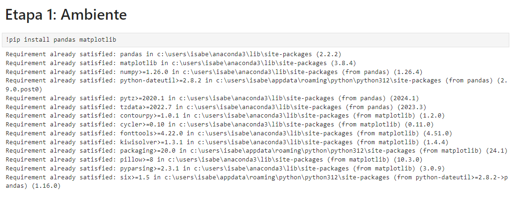  

## Etapa 2: Desenvolvimento
1 - No início da etapa 2 de desenvolvimento, importei as bibliotecas Pandas e Matplotlib, li o arquivo csv dos dados da Google Play Store e removi as linhas duplicadas que contém no arquivo:

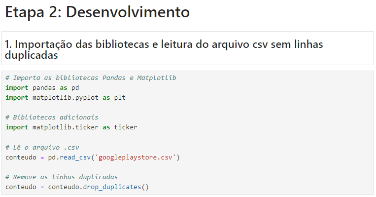  

2 - Para o requisito 2 da etapa foi preciso fazer uma função para tratar os dados contidos na coluna 'Installs' do arquivo csv, pois continha valores string e para realizar a ordenação dos valores primeiramente tive que converte-los para valores numéricos. Após os dados serem convertidos, eu os ordenei em ordem decrescente e guardei apenas os 5 primeiros dados. Com os dados guardados, criei o gráfico utilizando a biblioteca do matplotlib, formatei os valores do eixo x e configurei o gráfico visualmente. Acrescentei comentários em todas as linhas para melhor compreensão do código e por fim, obtive o seguinte resultado:

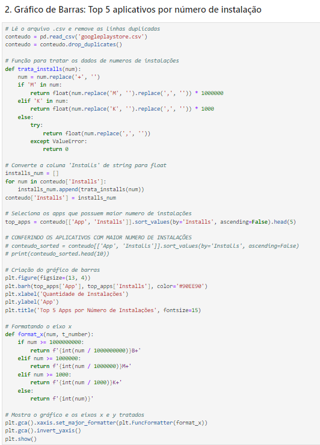  
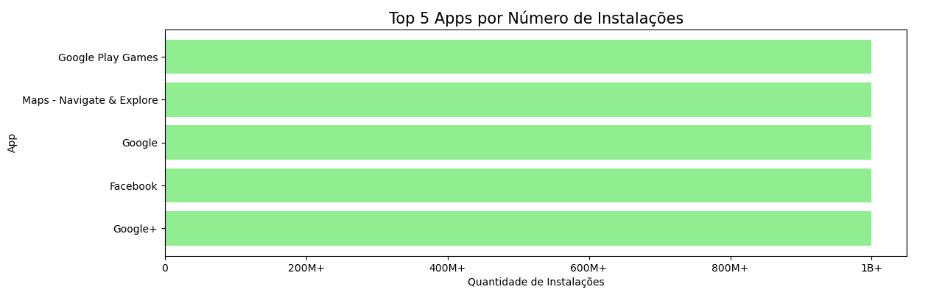  

3 - No requisito 3 da etapa não foi preciso fazer tratamento de dados, o código remove as linhas duplicadas e conta quantos apps de cada categoria há no dataset com base na coluna 'Category'. Com a quantidade de apps de cada categoria guardada, gerei o gráfico de pizza utilizando a biblioteca do matplotlib e configurei as posições das porcentagens para elas não se sobrescreverem, pois há muitos dados no gráfico. O resultado ficou da seguinte forma:

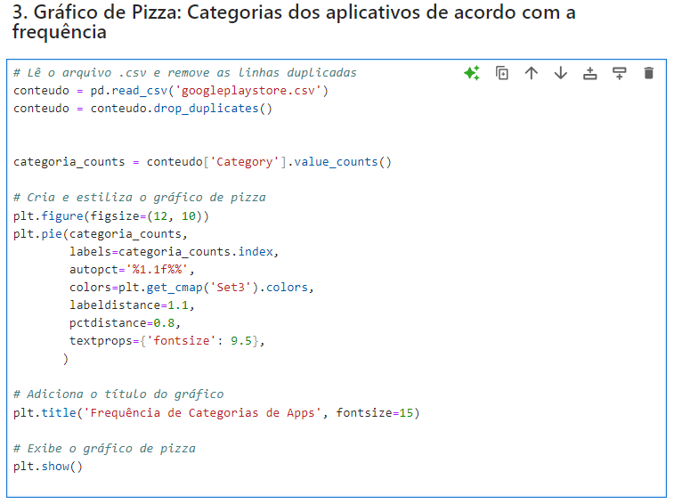
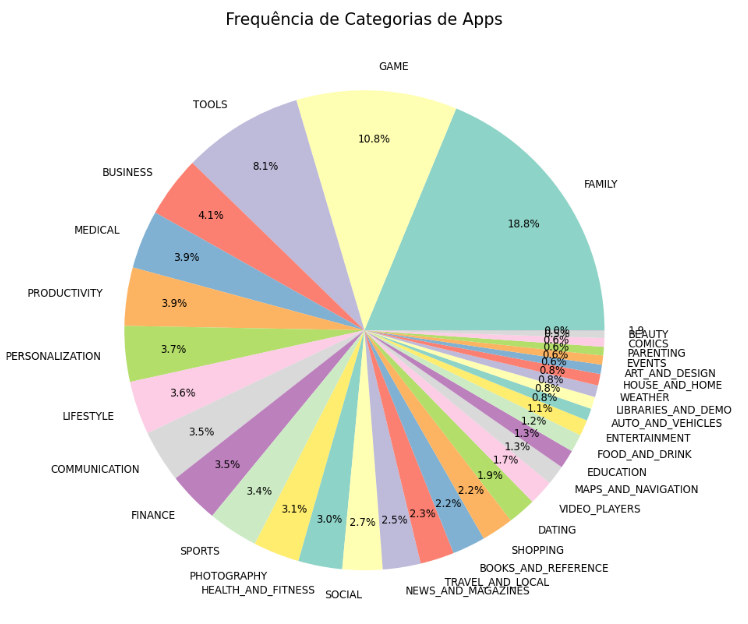  

4 - Para o requisito 4 mais uma vez foi necessário tratar os dados para trabalhar com eles em formato numérico através de uma função. Com os dados devidamente convertidos foi procurada e guardada a linha que possui o app com o maior preço, ao ser encontrada foram printados os dados do nome e preço do aplicativo mais caro e também foi criado um gráfico de dispersão para exibir esse dado:

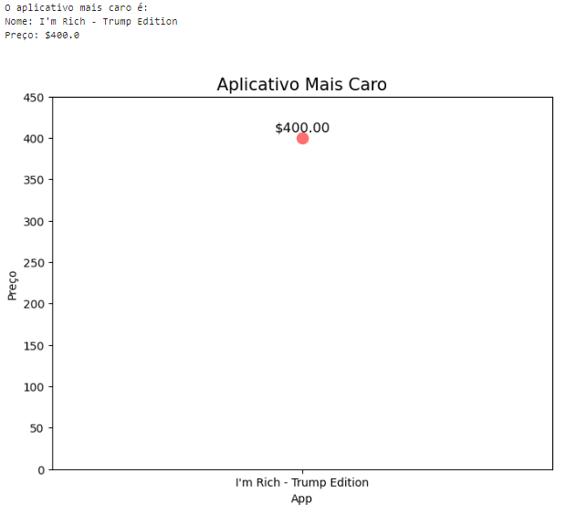  

5 - No requisito 5 foi feito um count de todos os aplicativos no dataset que possuem a classificação 'Mature 17+' e esse dado foi printado. Além de printado também fiz um gráfico de dispersão para exibir esse valor graficamente:

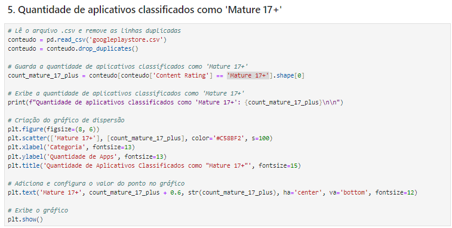
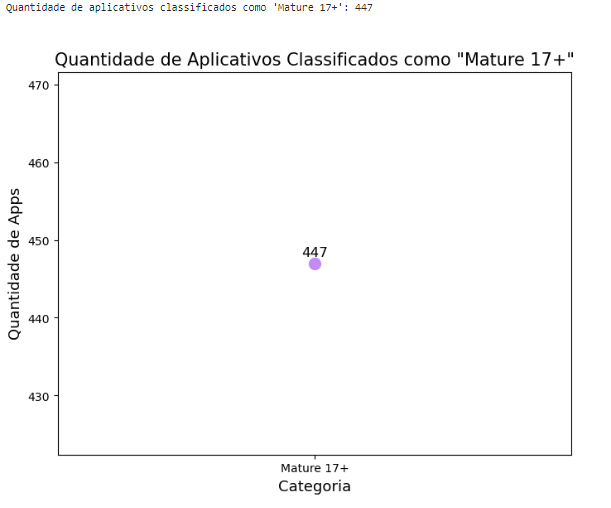  

6 - Para o requisito 6 fiz uma função para tratar os dados da coluna 'Reviews' a fim de trabalhar com eles em formato numérico. Com os dados tratados, agrupei as reviews por aplicativo e guardei os 10 maiores valores encontrados ordenando os dados em ordem decrescente. Com os dados encontrados, gerei o gráfico de barras utilizando o matplotlib e adicionei os números de reviews nas respectivas barras. Ademais, formatei os valores exibidos no eixo x do gráfico e obtive o seguinte resultado:

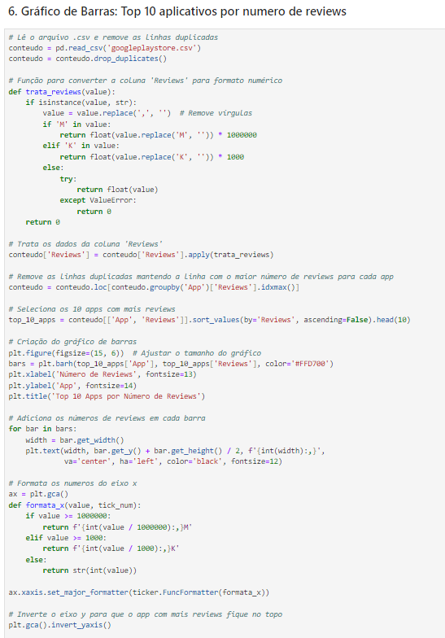
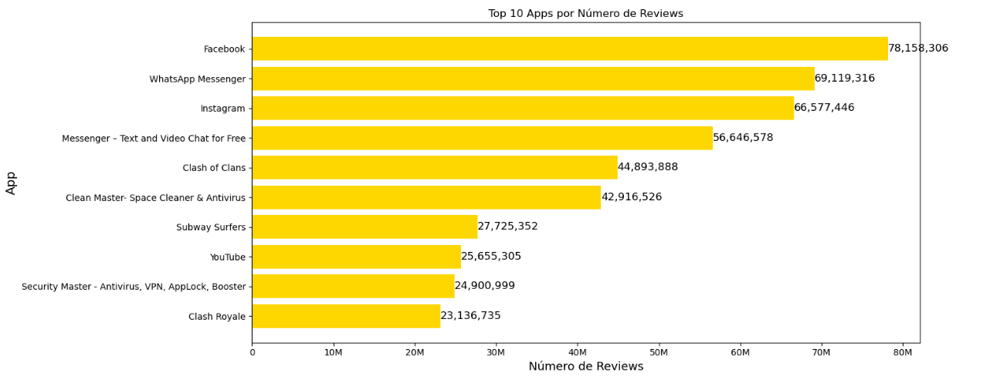  

7.1 - O primeiro cálculo criado para o requisito 7 foi a média dos valores dos apps pagos. Fiz a média dos dados da coluna 'Price' e a exibição foi feita através de um print:

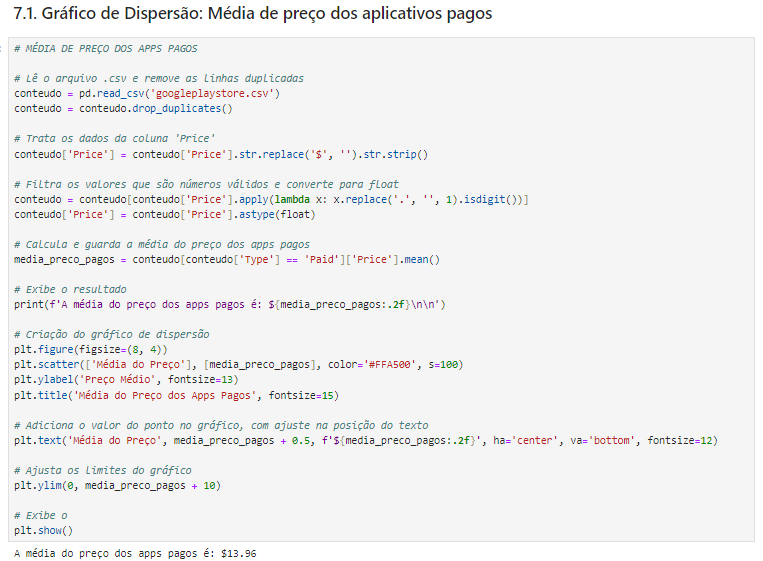  

8.1 - Como pede o requisito 8, os cálculos criados devem ser exibidos em formatos diferentes dos gráficos de barra e de pizza. Sendo assim, exibi a média de preço dos aplicativos pagos em um gráfico de dispersão:

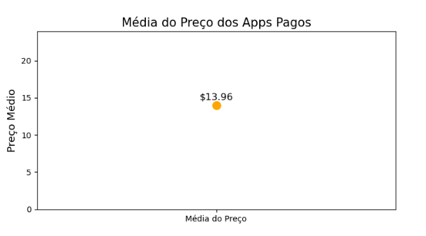  

7.2 - O segundo cálculo que criei para o requisito 7 foi a quantidade de aplicativos por avaliação no dataset. Primeiro precisei tratar a coluna 'Rating' pois possui valores com dois dígitos inteiros, após tratados os dados foi feita uma contagem de apps agrupados por avaliação e foram exibidos em uma lista:

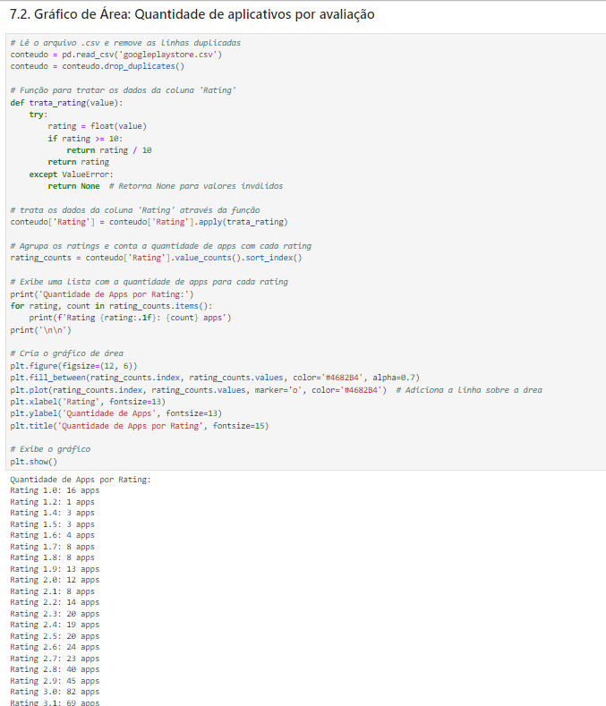  

8.2 - Novamente o cálculo deve ser exibido em um gráfico diferente dos explorados então resolvi exibir a quantidade de aplicativos por avaliação em um gráfico de área:

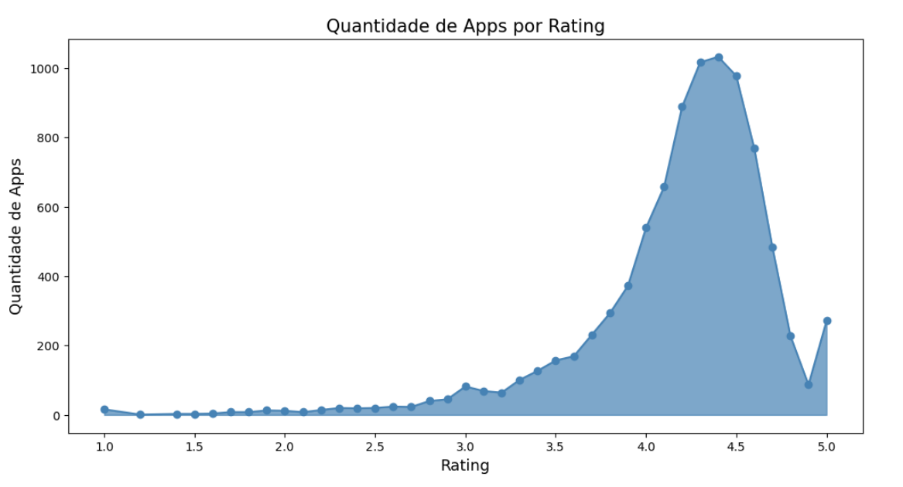  

