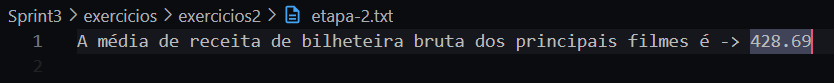
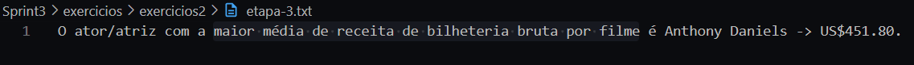
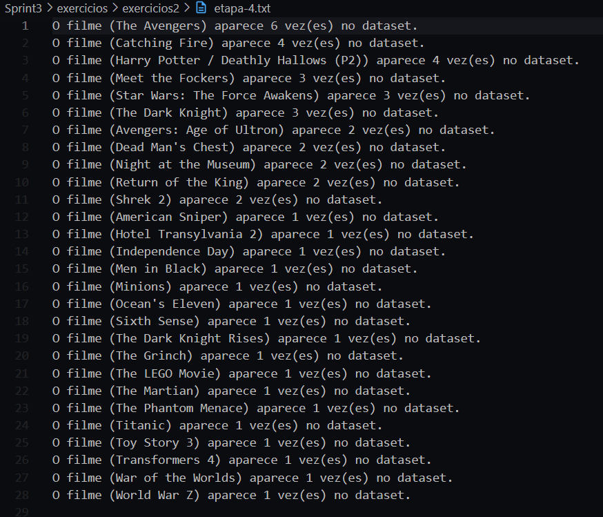
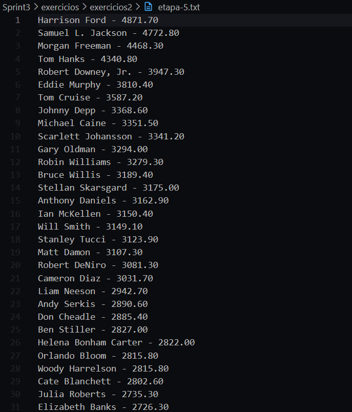
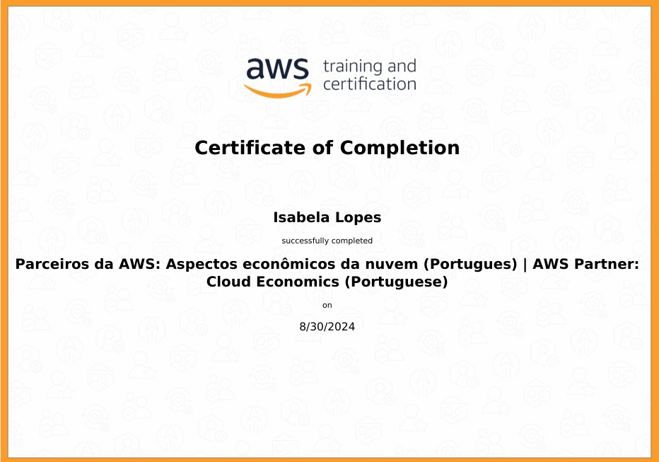

# Exercícios

### Exercicios Python I

1. [Exercicio 1.](exercicios/exercicios1/exercicio_1.py)
2. [Exercicio 2.](exercicios/exercicios1/exercicio_2.py)
3. [Exercicio 3.](exercicios/exercicios1/exercicio_3.py)
4. [Exercicio 4.](exercicios/exercicios1/exercicio_4.py)
5. [Exercicio 5.](exercicios/exercicios1/exercicio_5.py)
6. [Exercicio 6.](exercicios/exercicios1/exercicio_6.py)
7. [Exercicio 7.](exercicios/exercicios1/exercicio_7.py)
8. [Exercicio 8.](exercicios/exercicios1/exercicio_8.py)
9. [Exercicio 9.](exercicios/exercicios1/exercicio_9.py)
10. [Exercicio 10.](exercicios/exercicios1/exercicio_10.py)
11. [Exercicio 11.](exercicios/exercicios1/exercicio_11.py)
12. [Exercicio 12.](exercicios/exercicios1/exercicio_12.py)
13. [Exercicio 13.](exercicios/exercicios1/exercicio_12.py)
14. [Exercicio 14.](exercicios/exercicios1/exercicio_14.py)
15. [Exercicio 15.](exercicios/exercicios1/exercicio_15.py)
16. [Exercicio 16.](exercicios/exercicios1/exercicio_16.py)
17. [Exercicio 17.](exercicios/exercicios1/exercicio_17.py)
18. [Exercicio 18.](exercicios/exercicios1/exercicio_18.py)
19. [Exercicio 19.](exercicios/exercicios1/exercicio_19.py)
20. [Exercicio 20.](exercicios/exercicios1/exercicio_20.py)
21. [Exercicio 21.](exercicios/exercicios1/exercicio_21.py)
22. [Exercicio 22.](exercicios/exercicios1/exercicio_22.py)
23. [Exercicio 23.](exercicios/exercicios1/exercicio_23.py)
24. [Exercicio 24.](exercicios/exercicios1/exercicio_24.py)
25. [Exercicio 25.](exercicios/exercicios1/exercicio_25.py)

### Exercicios Python II
1. [Etapa 1](exercicios/exercicios2/etapa_1.py)  
[resultado obtido](exercicios/exercicios2/etapa-1.txt)  
  
2. [Etapa 2](exercicios/exercicios2/etapa_2.py)  
[resultado obtido](exercicios/exercicios2/etapa-2.txt)

3. [Etapa 3](exercicios/exercicios2/etapa_3.py)  
[resultado obtido](exercicios/exercicios2/etapa-3.txt)

4. [Etapa 4](exercicios/exercicios2/etapa_4.py)  
[resultado obtido](exercicios/exercicios2/etapa-4.txt)

5. [Etapa 5](exercicios/exercicios2/etapa_5.py)  
[resultado obtido](exercicios/exercicios2/etapa-5.txt)

# Evidências

**Exercicios Python II:**

**Etapa 1:** Ao executar o código da etapa 1, todos os dados da coluna 'Number of Movies' foram percorridos e comparados para encontrar o maior número da coluna. Ao ser encontrado ele foi guardado, também foi guardado o nome do ator que possui a quantidade de filmes encontrada e ambos os dados foram exibidos no arquivo etapa-1.txt:  

  

**Etapa 2:** Ao executar o código da etapa 2, todos os dados da coluna 'Gross' foram somados e guardados em uma variavel soma e a cada numero somado foi incrementado um contador, utilizando as duas variáveis foi feita a média de receita de bilheteira bruta dos principais filmes que foi exibida no arquivo etapa-2.txt:

  

**Etapa 3:** Ao executar o código da etapa 3, todos os dados da coluna 'Average per Movie' foram percorridos e comparados para encontrar o maior número da coluna. Ao ser encontrado ele foi guardado, também foi guardado o nome do ator que possui a maior média de receita de bilheteria bruta por filme e ambos os dados foram exibidos no arquivo etapa-3.txt:  

  

**Etapa 4:** Ao executar o código da etapa 4, todos os dados da coluna '#1 Movie' foram percorridos e foi contado quantas vezes o filme aparece no dataset. As quantidades encontradas por filmes e o nome dos filmes foram exibidos em uma lista no arquivo etapa-4.txt em ordem de frequência decrescente:

  

**Etapa 5:** Ao executar o código da etapa 5, todos os dados da coluna 'Total Gross' foram exibidos em ordem decrescente em uma lista no arquivo etapa-5.txt juntamente com o nome do ator que possui a respectiva receita bruta de bilheteria. As primeiras linhas do arquivo são:

  

# Certificados

- AWS Partner: Cloud Economics
