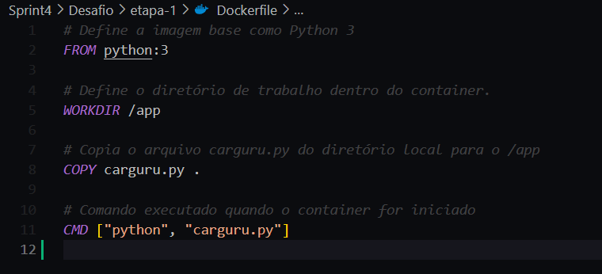
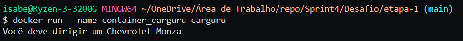
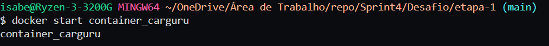
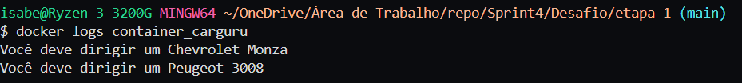
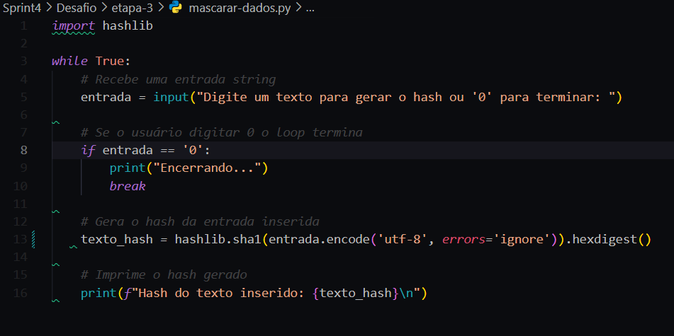
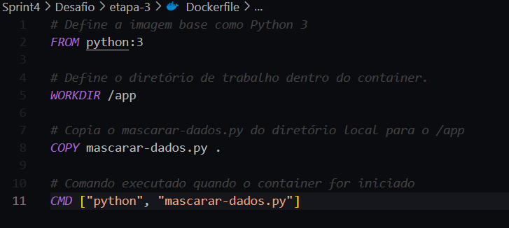
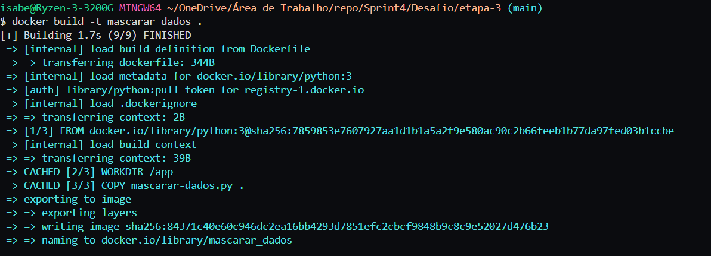
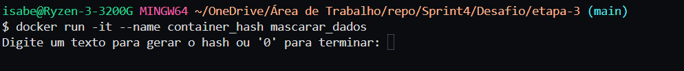
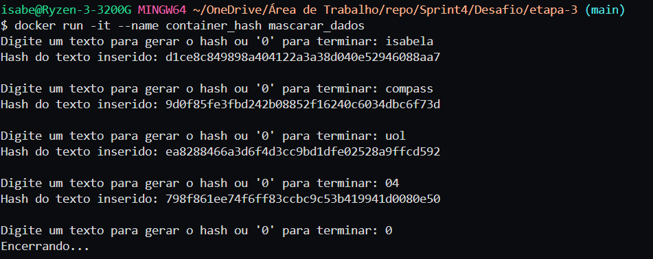

# Etapas

1. [Etapa 1](etapa-1/Dockerfile)  
2. [Etapa 2](etapa-2/etapa-2.md)  
3. Etapa 3:  
[Arquivo python](etapa-3/mascarar-dados.py)  
[Dockerfile](etapa-3/Dockerfile)

## Etapa 1
Para iniciar a etapa 1, adicionei o arquivo carguru.py ao diretório de desenvolvimento do desafio e criei um Dockerfile que descreve o processo para criar uma imagem Docker que executa o script Python:

  

Com o Dockerfile criado, utilizei o comando 'docker build' no terminal para construir a imagem: 

  

Em seguida, usei o comando 'docker run' para rodar o container. Ao executar o container, o script imprime no terminal uma mensagem com o nome de um carro aleatório utilizando a função random(), escolhido a partir de uma lista de vários nomes de carros contidos no script python que ele executa:

  

## Etapa 2

Na etapa 2 do desafio, criei um arquivo Markdown para responder ao questionamento sobre a possibilidade de reutilizar containers. Respondi que é sim possível, pois o Docker preserva o sistema de arquivos e as configurações do container. Para reiniciar um container parado, basta utilizar o comando: 'docker start (nome do container)' ou 'docker start (id do container)'. Como exemplo, reiniciei o container gerado na etapa-1 (o qual estava parado) usando o comando:

  

E o container iniciou novamente como esperado mas não exibiu a mensagem gerada pelo script python. Para acessar as mensagens geradas por ele, é preciso utilizar o comando 'docker logs': 

  

## Etapa 3
Por fim, na etapa 3 do desafio, criei um arquivo mascarar-dados.py que possui um loop que só se encerra se o usuário digitar 0. Caso o usuário insira qualquer outro texto, o script converte a entrada para bytes e calcula o hash SHA-1 usando hashlib.sha1(). O resultado é convertido para uma string hexadecimal com hexdigest() e impresso no terminal. O programa continua solicitando valores até que a entrada seja 0:

  

Após criar o arquivo Python, criei o Dockerfile responsável pela construção da imagem e o executei no terminal: 

  

Também dei o comando para rodar o container de forma que os inputs fossem inseridos no próprio terminal utilizando o comando 'docker run -it':

  

Ao iniciar, o container executa os scripts Python descritos acima e encerra quando o usuário insere '0' no input: 

  
