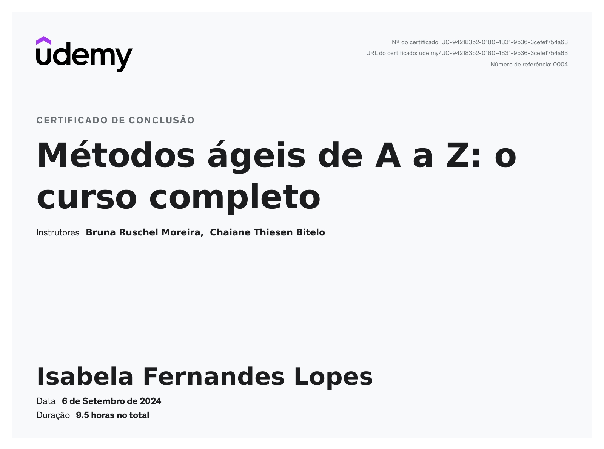
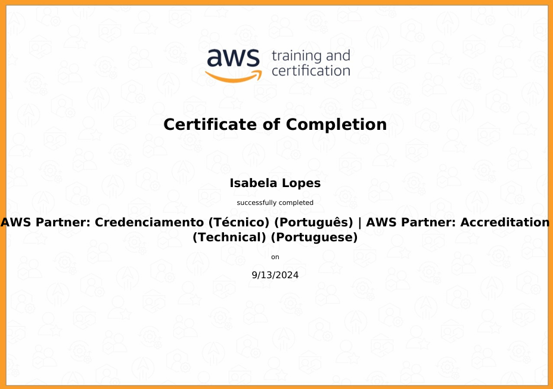
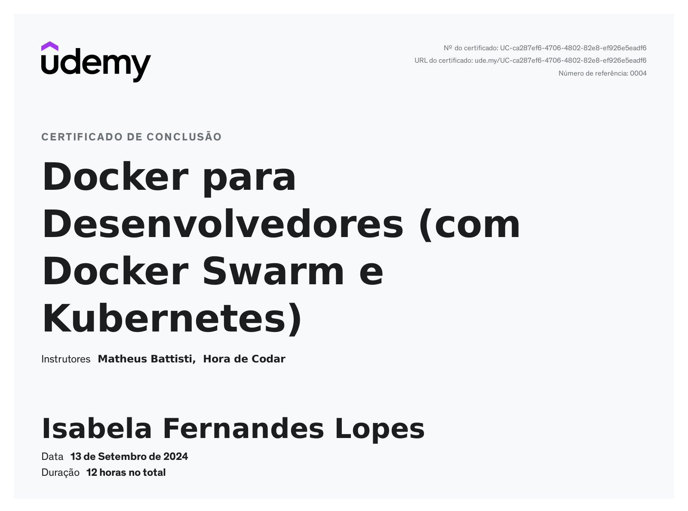
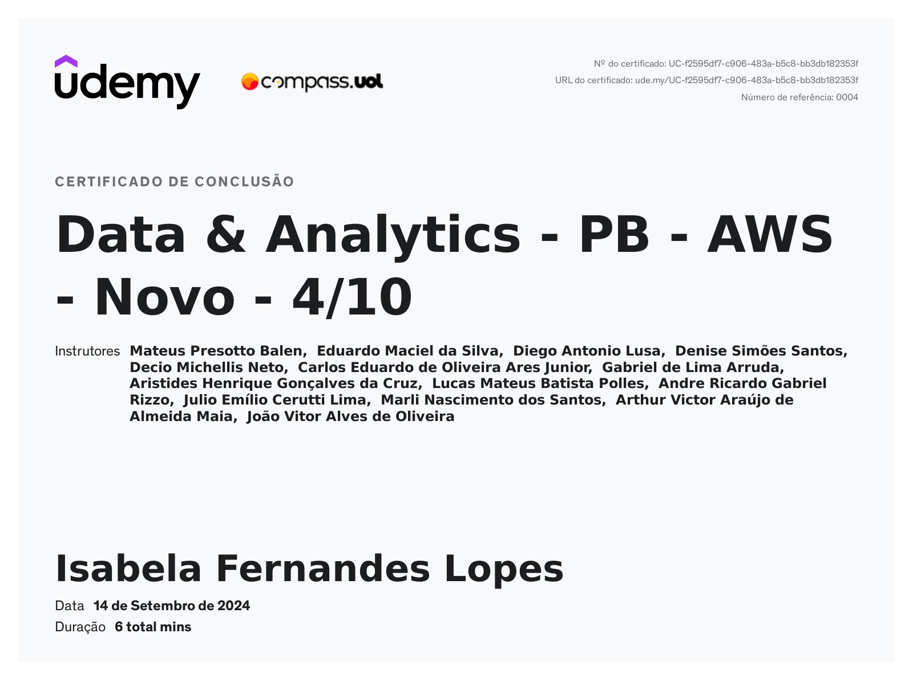

# Exercícios

1. [Exercicio 1.](exercicios/exercicio_1.py)
2. [Exercicio 2.](exercicios/exercicio_2.py)
3. [Exercicio 3.](exercicios/exercicio_3.py)
4. [Exercicio 4.](exercicios/exercicio_4.py)
5. [Exercicio 5.](exercicios/exercicio_5.py)
6. [Exercicio 6.](exercicios/exercicio_6.py)
7. [Exercicio 7.](exercicios/exercicio_7.py)
  

# Certificados

- Métodos ágeis de A a Z: o curso completo
  

- AWS Partner: Accreditation
  

- Docker para Desenvolvedores
  

- Data & Analytics - PB - AWS - Novo - 4/10
  