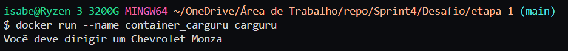

# Exercícios

### Exercicios 

1. [Exercicio 1.](exercicios/exercicio_1.py)
2. [Exercicio 2.](exercicios/exercicio_2.py)
3. [Exercicio 3.](exercicios/exercicio_3.py)
4. [Exercicio 4.](exercicios/exercicio_4.py)
5. [Exercicio 5.](exercicios/exercicio_5.py)
6. [Exercicio 6.](exercicios/exercicio_6.py)
7. [Exercicio 7.](exercicios/exercicio_7.py)

# Evidências

**Exercicios:**

**Etapa 1:** Ao executar o código da etapa 1, todos os dados da coluna 'Number of Movies' foram percorridos e comparados para encontrar o maior número da coluna. Ao ser encontrado ele foi guardado, também foi guardado o nome do ator que possui a quantidade de filmes encontrada e ambos os dados foram exibidos no arquivo etapa-1.txt:  

  

**Etapa 2:** Ao executar o código da etapa 2, todos os dados da coluna 'Gross' foram somados e guardados em uma variavel soma e a cada numero somado foi incrementado um contador, utilizando as duas variáveis foi feita a média de receita de bilheteira bruta dos principais filmes que foi exibida no arquivo etapa-2.txt:

  

**Etapa 3:** Ao executar o código da etapa 3, todos os dados da coluna 'Average per Movie' foram percorridos e comparados para encontrar o maior número da coluna. Ao ser encontrado ele foi guardado, também foi guardado o nome do ator que possui a maior média de receita de bilheteria bruta por filme e ambos os dados foram exibidos no arquivo etapa-3.txt:  

  

**Etapa 4:** Ao executar o código da etapa 4, todos os dados da coluna '#1 Movie' foram percorridos e então foi contado quantas vezes o filme aparece no dataset. As quantidades encontradas por filmes e o nome dos filmes foram exibidos em uma lista no arquivo etapa-4.txt em ordem de frequência decrescente:

  

**Etapa 5:** Ao executar o código da etapa 5, todos os dados da coluna 'Total Gross' foram exibidos em ordem decrescente em uma lista no arquivo etapa-5.txt juntamente com o nome do ator que possui a respectiva receita bruta de bilheteria. As primeiras linhas do arquivo são:

  

# Certificados

- Métodos ágeis de A a Z: o curso completo
  

- AWS Partner: Accreditation
  

- Docker para Desenvolvedores
  

- Data & Analytics - PB - AWS - Novo - 4/10
  