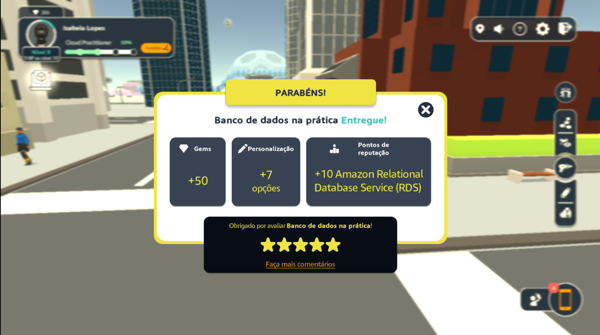
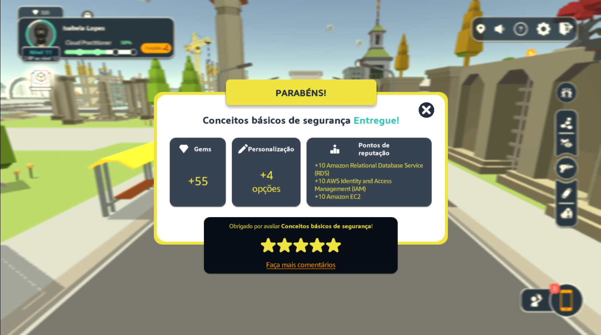
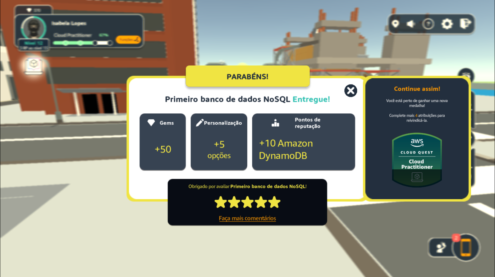
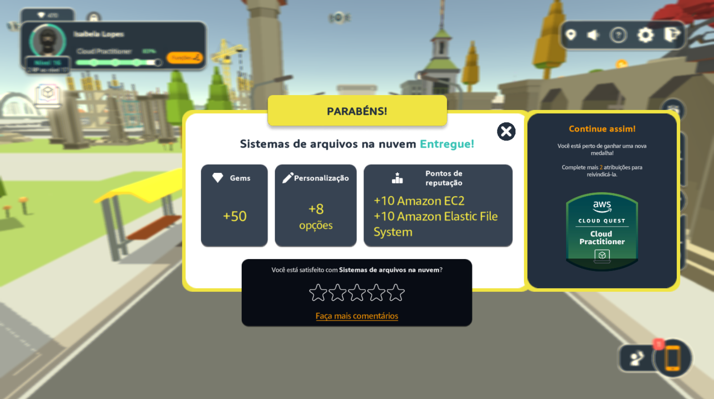
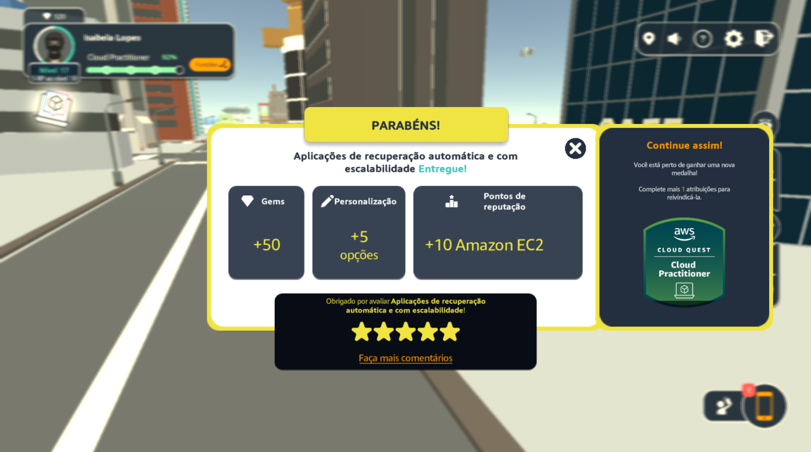
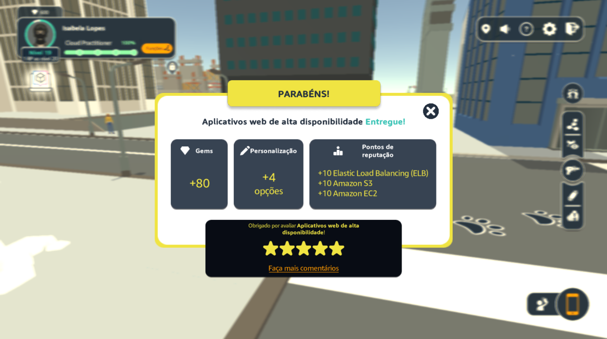
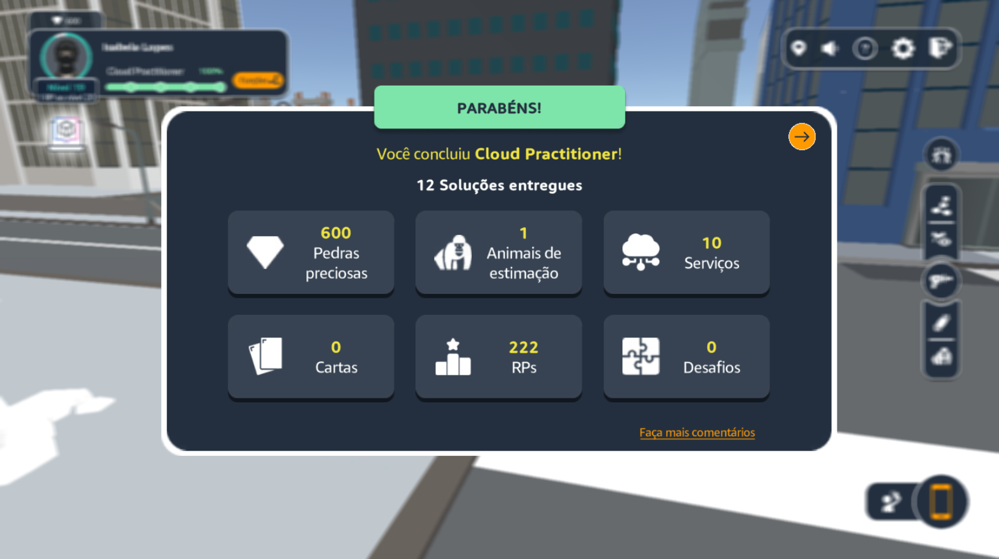
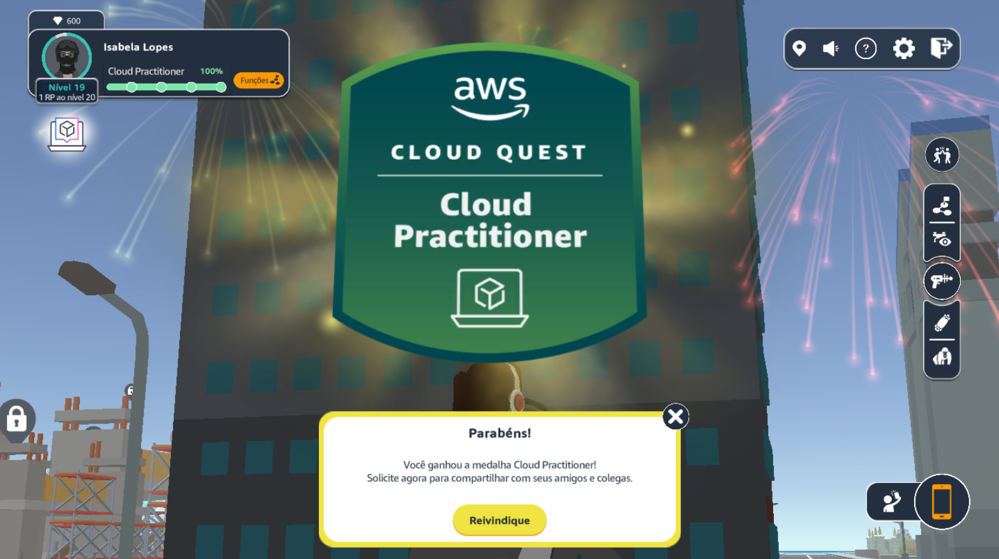
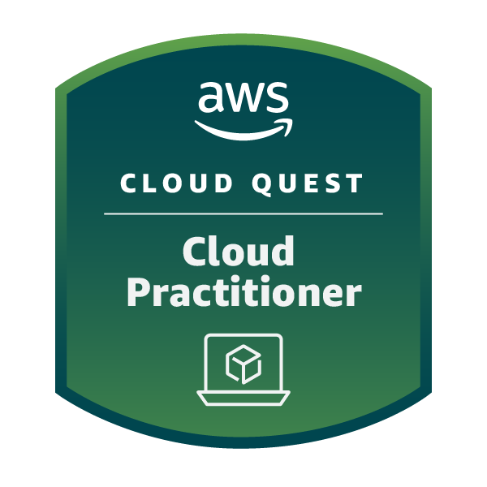
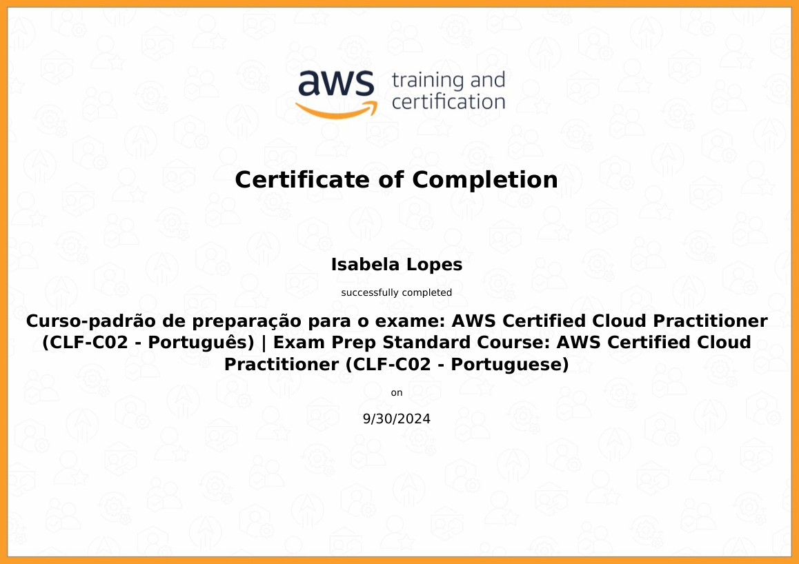

# Evidências

No jogo da AWS, explorei uma variedade de casos de uso dos recursos disponíveis, aplicando soluções da AWS para resolver problemas do mundo real. Após a realização de algumas das tarefas, fiz alguns registros:

Entrega da tarefa "Banco de dados na prática":
  

Entrega da tarefa "Conceitos básicos de segurança":
  

Entrega da tarefa "Primeiro banco de dados no SQL":
  

Entrega da tarefa "Sistemas de arquivo na nuvem":
  

Entrega da tarefa "Aplicações de recuperação automática e com escalabilidade":
  

Entrega da tarefa "Aplicativos web de alta disponibilidade":
  

Game concluído:
  

Emblema Cloud Practitioner recebido:
  

# Certificados

- AWS Cloud Quest: Cloud Practitioner   
EMBLEMA:  
  
LINK: https://www.credly.com/users/isabela-fernandes-lopes  

- AWS Certified Cloud Practitioner  
  

