# Análise do Desafio

Popularidade de atores em filmes e séries de comédia/animação com base no número de votos e nota média de filmes lançados a partir de 1990.

## Sobre o que se trata?

Esta análise busca explorar a relação entre a popularidade de atores e atrizes em filmes e séries de comédia e animação e a recepção desses conteúdos por parte do público e da crítica. Através dos dados disponíveis, serão investigadas as seguintes questões:

- Quais atores ou atrizes aparecem com maior frequência em filmes e séries de comédia/animados lançados após 1990.
- Se há uma correlação entre a participação desses atores e o sucesso dos filmes, com base no número de votos e na nota média obtida.
- Como a qualidade dos filmes, representada pela nota média, está relacionada à popularidade dos atores, medida pelo número de votos recebidos.

## Qual a motivação da análise?

A escolha dessa análise surge da importância do elenco, especialmente em filmes de comédia e animação, na conquista do público. Gêneros populares como esses geralmente dependem de atores carismáticos e reconhecidos para atrair grandes audiências. A análise ajudará a identificar padrões que podem ser úteis tanto para o desenvolvimento de novas produções quanto para entender o impacto dos atores sobre a popularidade e a avaliação crítica dos filmes.  
Além disso, a análise dos dados visa descobrir se a presença de determinados atores pode estar associada a melhores avaliações e maior quantidade de votos, o que pode revelar tendências e preferências do público ao longo das últimas décadas.

# Desenvolvimento do Desafio

Iniciei o desafio criando um bucket no S3 chamado **"data-lake-filmes-series"**, no qual os conjuntos de dados de filmes e séries foram carregados:

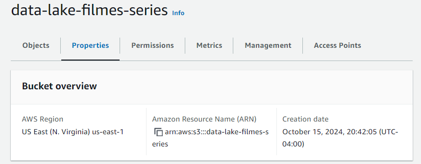  

Implementei um script Python e importei bibliotecas essenciais como boto3 e zipfile, além de outras para acessar minha conta AWS:

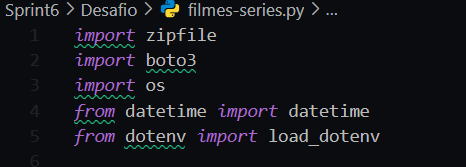  

Optei por trabalhar com os dados CSV compactados, a fim de submete-los posteriormente no github (que não aceita arquivos muito grandes). Portanto, utilizei a lib zipfile, nativa do python, para descompactar o arquivo **filmes-series.zip** que contém os arquivos CSV. A função extract_zip() foi desenvolvida para extrair o conteúdo do arquivo zip para o diretório local.

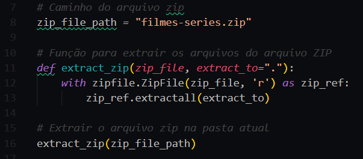  

Criei um arquivo **.env** com as credenciais da minha conta AWS, que foram carregadas no script com a função load_dotenv() da lib dotenv. Também configurei as variáveis para armazenar os caminhos dos diretórios no bucket S3:

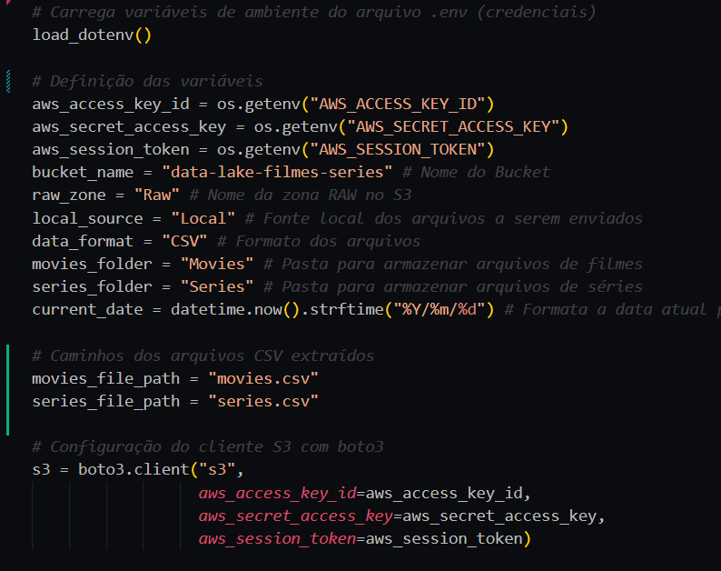  

Desenvolvi uma função que realiza o upload dos arquivos CSV para o bucket S3 usando a biblioteca boto3, a função recebe o caminho do arquivo, o nome do bucket e o caminho de destino no S3. O upload é realizado com o método s3.upload_file() da biblioteca boto3:

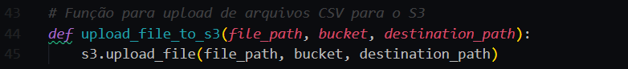  

Criei duas variáveis que armazenam os caminhos no S3 para os arquivos **movies.csv** e **series.csv**, seguindo o padrão: "<nome do bucket>/<camada de armazenamento>/<origem do dado>/<formato do dado>/<especificação do dado>/<data separada por ano/mês/dia>/<arquivo>".

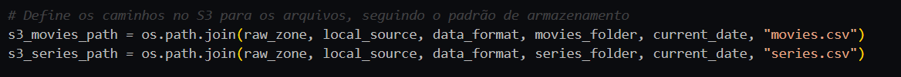  

Por fim, o script faz a chamada da função para fazer o upload dos arquivos **movies.csv** e **series.csv** para o bucket S3 dentro das pastas **Movies** e **Series** respectivamente, criadas automaticamente pelo código.

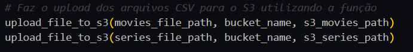  

Com o script python desenvolvido, implementei um **Dockerfile** para executar o processo dentro de um container Docker. A imagem base é Python 3, com o diretório de trabalho definido como **/app**. Todos os arquivos necessários são copiados para esse diretório, as dependências são instaladas e o script **filmes-series.py** é executado quando o container é iniciado:

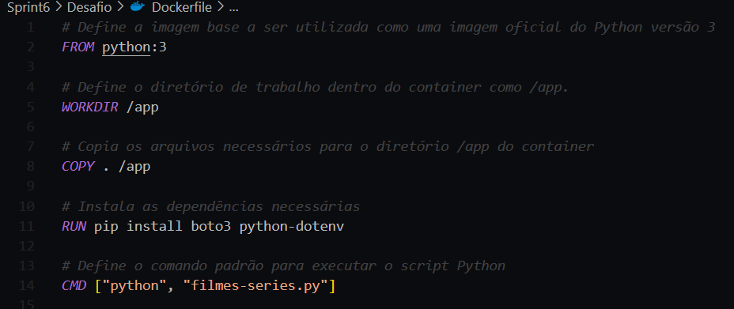  

Usei o comando "docker build -t img-filmes-series ." para construir a imagem docker, nomeando-a como **img-filmes-series**:

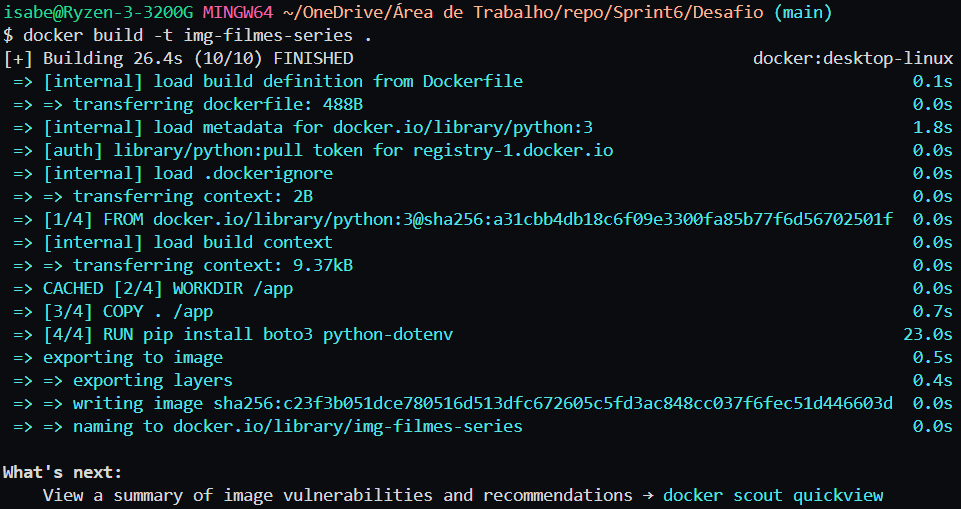  

Após criar a imagem, executei um container utilizando o script "docker run --name filmes-series --env-file .env -v filmes_volume:/app/data img-filmes-series", o script cria e executa um container chamado **"filmes-series"**, com variáveis de ambiente definidas no arquivo **.env** e um volume montado em **/app/data**, utilizando a imagem **img-filmes-series**.

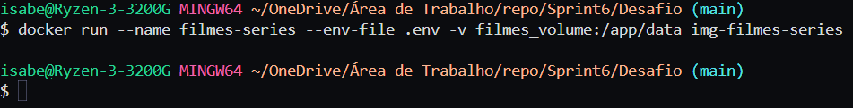  

Após a execução do container, os arquivos **movies.csv** e **series.csv** foram corretamente carregados e persistidos no bucket S3 **"data-lake-filmes-series"** nos diretórios especificados:

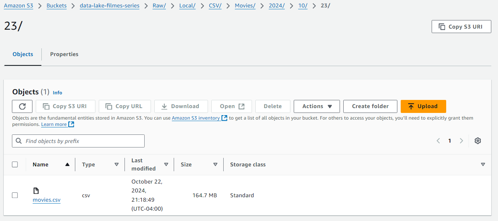
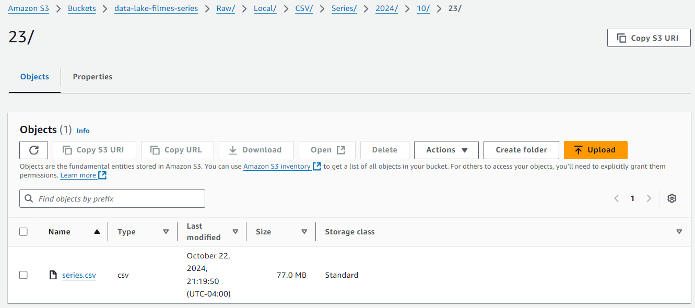  

