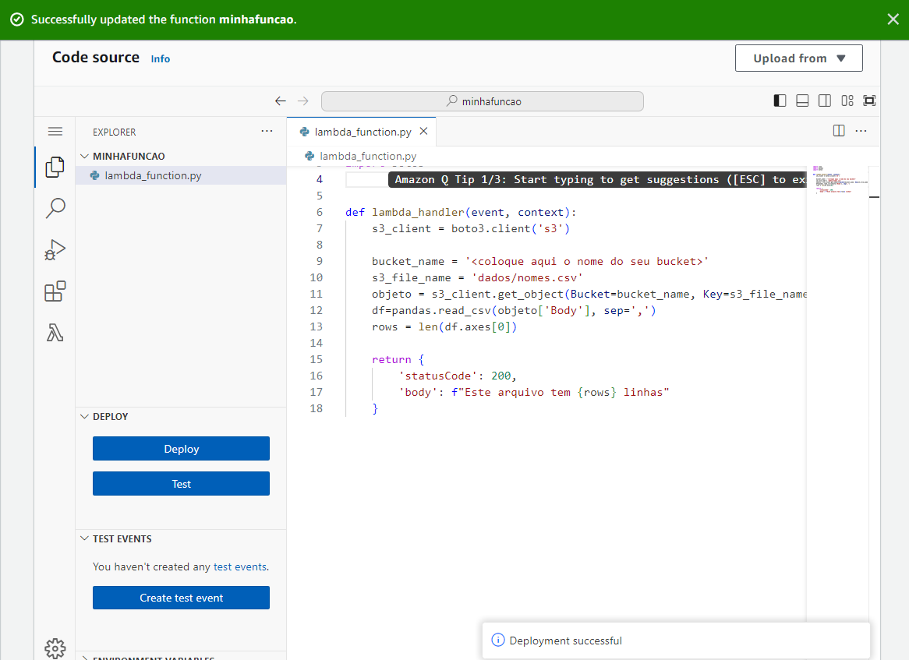
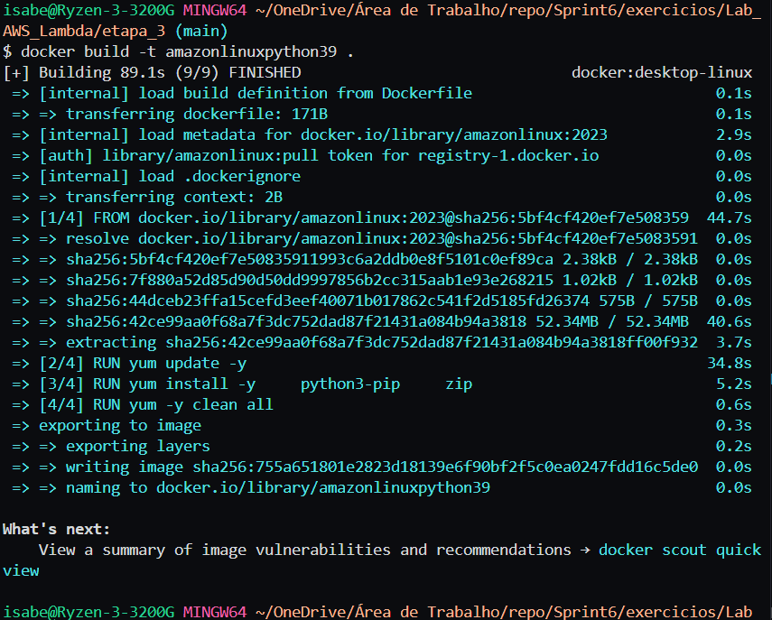
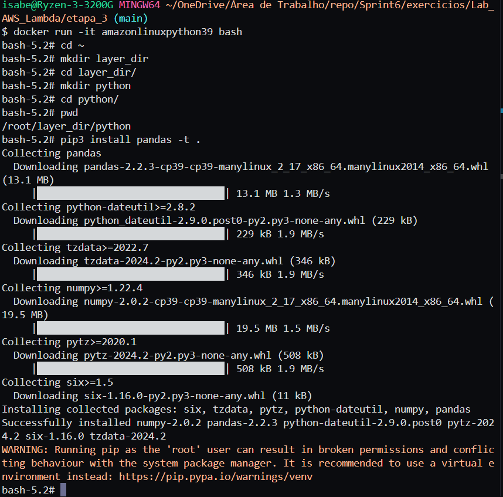
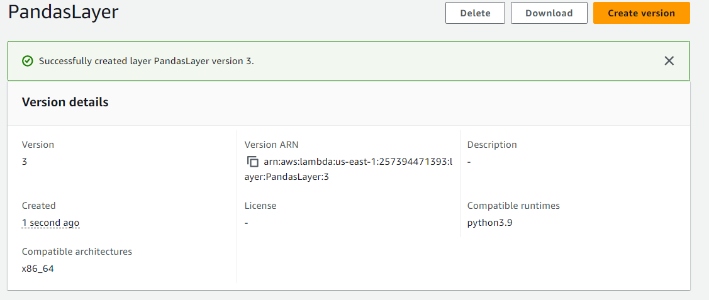
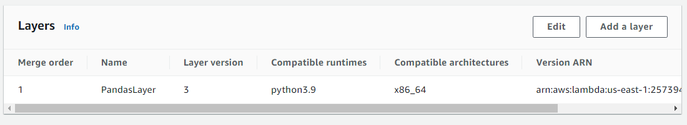
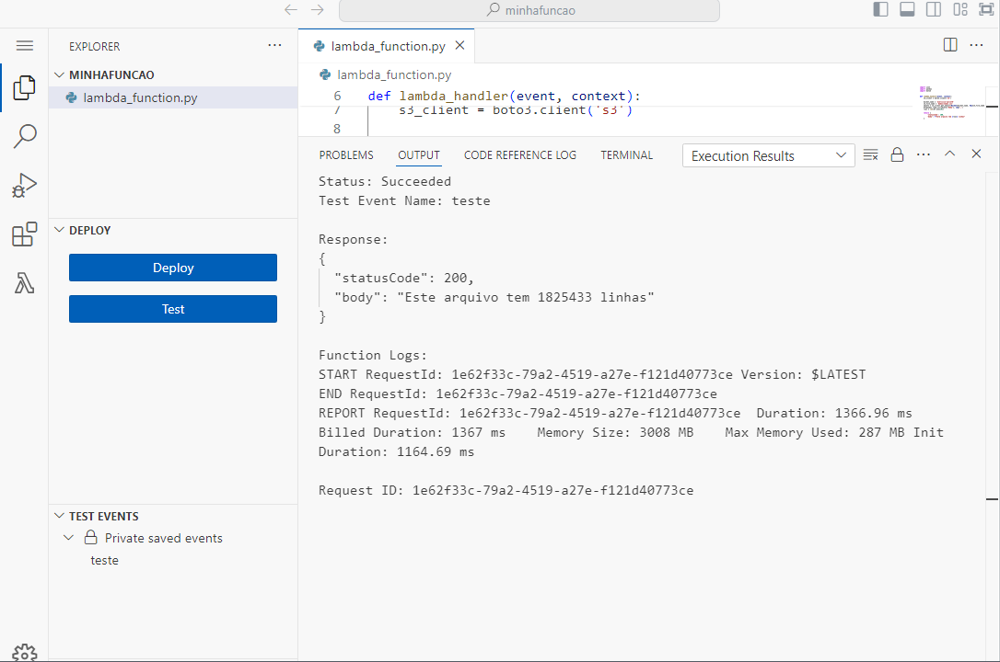

# Exercícios

## Lab AWS Athena

### Etapa 1: Configurar Athena

  

### Etapa 2: Criar um banco de dados
  

### Etapa 3: Criar uma tabela
  

### Query

  

### Resultado

  

## Lab AWS Lambda

### Etapa 1: Criar a função do Lambda

  

### Etapa 2: Construir o código
  

### Etapa3: Criar uma Layer

**3.1 Arquivo Dockerfile**  
  

**3.2 Criando imagem do Docker**  
  

**3.3 e 3.4 Rodando container e baixando as bibliotecas**  
  

**3.7 Compactando arquivos**  
  

**3.8 Copiando arquivo para máquina**  
  

**3.9 Upload do arquivo compactado no S3**  
  

**3.14 Criando uma Layer**  
  

### Etapa 4: Utilizando a Layer

**4.5 Adicionando a Layer à Função Lambda**  
  

**4.6 Executando código com o Test**  
  

# Certificados

- Fundamentals of Analytics on AWS - Part 1
  

- Fundamentals of Analytics on AWS - Part 2
  

- Serverless Analytics
  

- Introduction to Amazon Athena
  

- AWS Glue Getting Started
  

- Amazon EMR Getting Started
  

- Getting Started with Amazon Redshift
  

- Best Practices for Data Warehousing with Amazon Redshift
  

- Amazon QuickSight - Getting Started
  

- Data & Analytics - PB - AWS - Novo - 6/10
  
