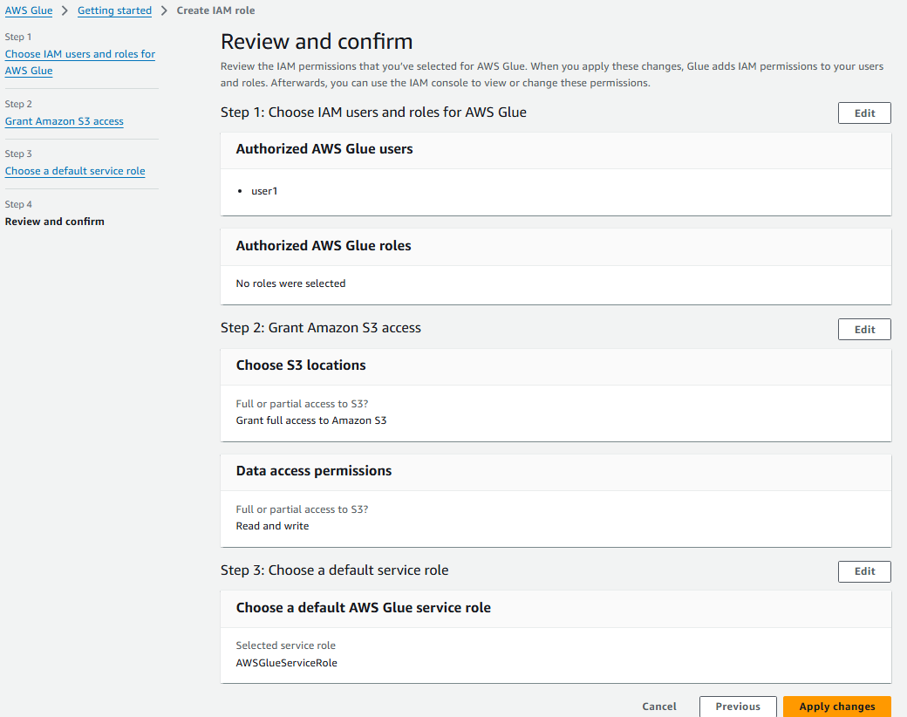

# Exercícios

## Lab AWS Glue

### Etapa 1: Preparando os dados de origem

  

### Etapa 2: Configurando sua conta para utilizar o AWS Glue
  

### Etapa 3: Criando a IAM Role para os jobs do AWS Glue
  

### Etapa 4: Configurando as permissões no AWS Lake Formation
  
  

### Etapa 5: Criando novo job no AWS Glue
  

### Etapa 5.2: Sua vez!
O código pode ser verificado [aqui](exercicios/Lab_AWS_Glue/script.py)   

### Resultado da execução no Bucket S3
  

#### Exemplo de arquivo json gerado:
  

### Log da execução
  

### Etapa 6: Criando novo crawler
  

#### Analisando a tabela no Glue Catalog:
  

#### Analisando os dados no Amazon Athena:
  

## Apache Spark - Contador de Palavras

### Etapa 1: Realizar o pull da imagem jupyter/all-spark-notebook
  

### Etapa 2: Criar um container a partir da imagem
  

#### Acessando o Jupyter Lab
  

### Etapa 3: Acessando o terminal do container
  

### Etapa 4: Contar palavras no README.md do repositório Git

Primeiramente, no terminal do container em execução, usei o comando curl -O (URL do README.md no Git), incluindo o token temporário, para baixar o arquivo README.md para o container. Após o download, usei o comando cat para verificar se o arquivo foi baixado corretamente:
  

Com o arquivo baixado com sucesso, iniciei o PySpark para realizar a análise no README.md:
    

Em seguida, inseri a sequência de comandos Spark necessários para contar as ocorrências de cada palavra presente no arquivo README.md e obtive um resultado satisfatório:
  

O script python também foi testado no jupyter Lab, o código e os resultados podem ser conferidos [aqui](exercicios/Apache_Spark/script.ipynb)

# Certificados

- Data & Analytics - PB - AWS - Novo - 7/10
  
