# Exercícios

## Exercicios Spark Batch

**Geração e massa de dados**

1. [Etapa 1](exercicios/exercicios%20Spark%20Batch/etapa1_inteiros.py)  
2. [Etapa 2](exercicios/exercicios%20Spark%20Batch/etapa2_animais.py)  
[Etapa 2: Arquivo csv gerado](exercicios/exercicios%20Spark%20Batch/animais.csv)  
3. [Etapa 3](exercicios/exercicios%20Spark%20Batch/etapa3_nomes.py)  
[Etapa 3: Arquivo txt gerado](exercicios/exercicios%20Spark%20Batch/nomes_aleatorios.zip)  

**Apache Spark**  
1. [Apache Spark](exercicios/exercicios%20Spark%20Batch/apache_spark.py)

## Exercicios TMDB
1. [Etapa 2](exercicios/exercicios%20TMDB/api.py)  

# Evidencias

**## Exercício TMDB**

### Etapa 1: Criando a conta TMDB
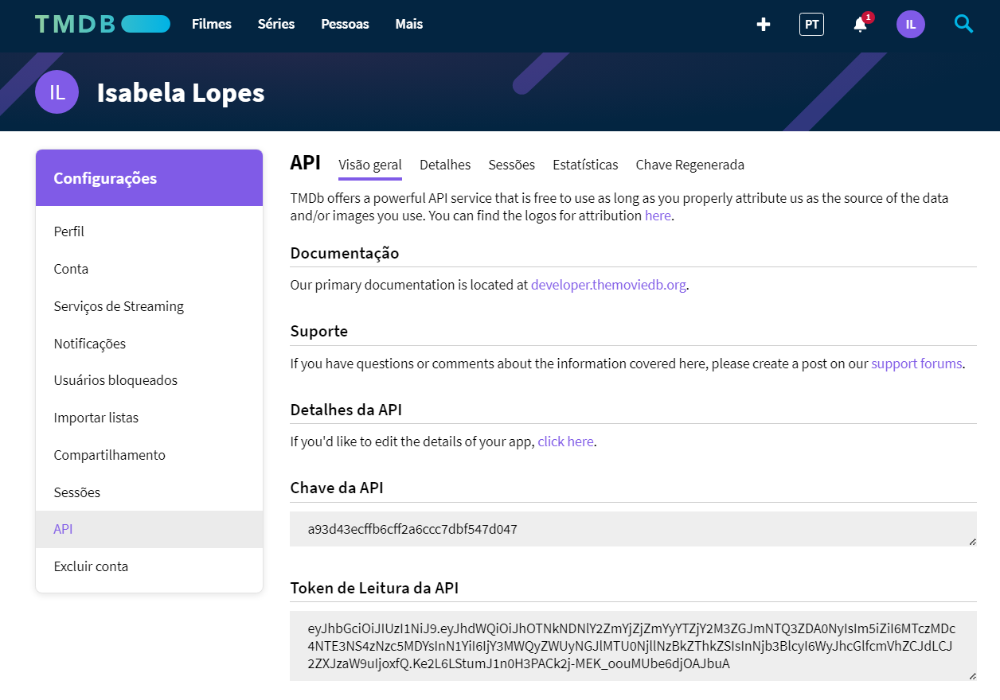  

### Etapa 2: Testando as credenciais e a biblioteca
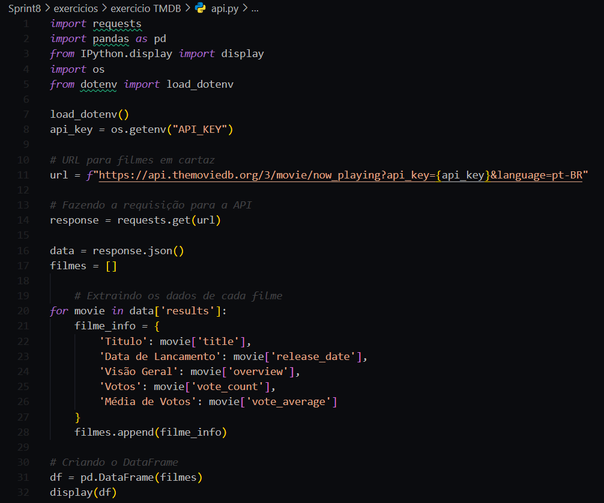  

### Resultado da execução: Exibindo filmes em cartaz 
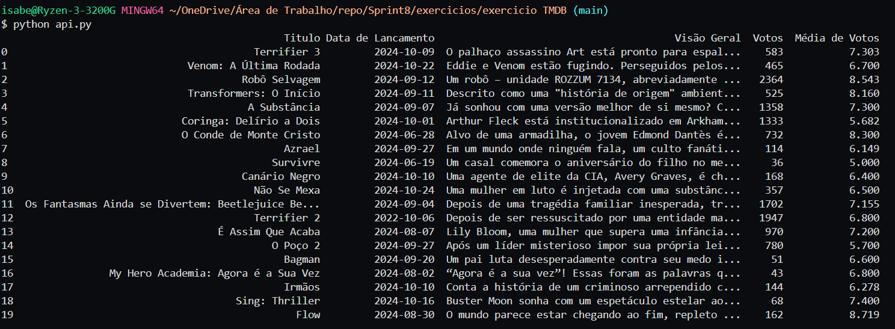  

**## Exercícios Spark Batch**

**### Geração e massa de dados**
### Etapa 1: Lista contendo 250 inteiros aleatórios.
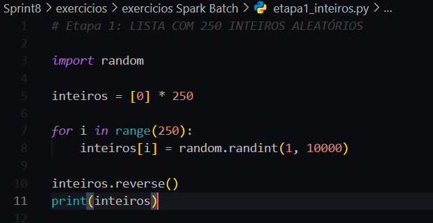  

### Etapa 1: Resultado da execução
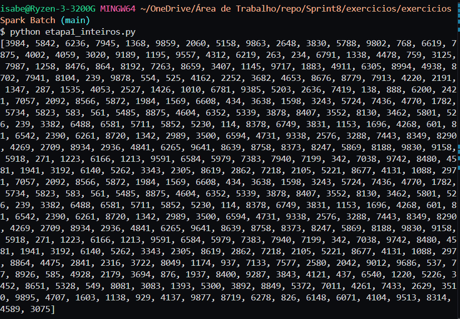  

### Etapa 2: Lista de 20 animais csv
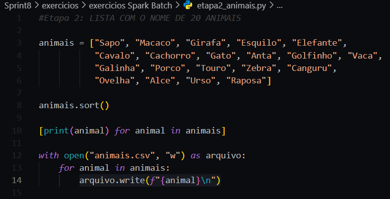  

### Etapa 2: Resultado da execução
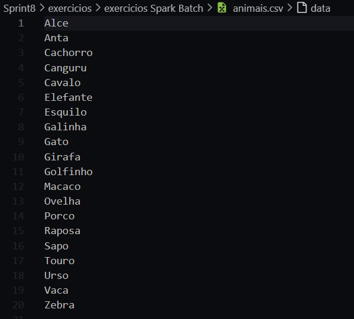  

### Etapa 3: Dataset de nomes de pessoas
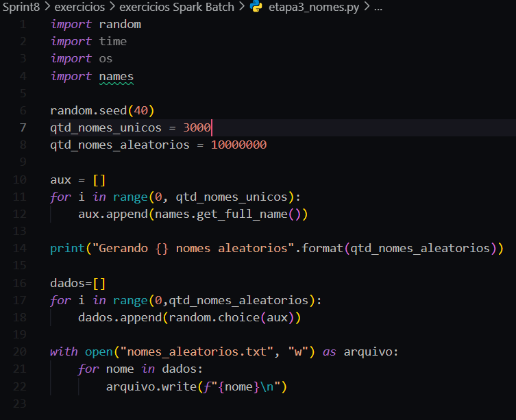  

### Etapa 3: Resultado da execução
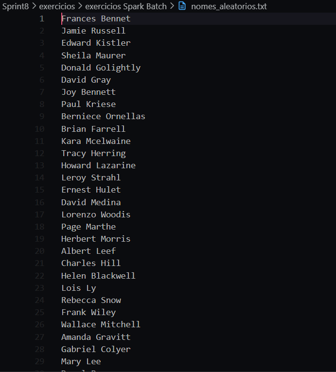  

**### Apache Spark**
### Etapa 1
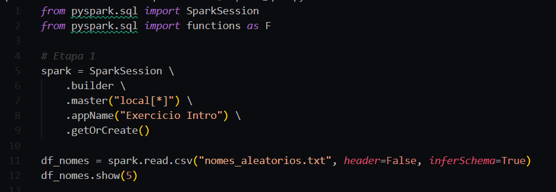  

### Etapa 2
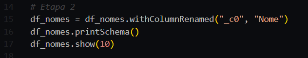  

### Etapa 3
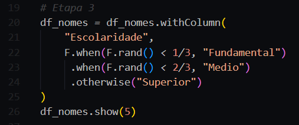  

### Etapa 4
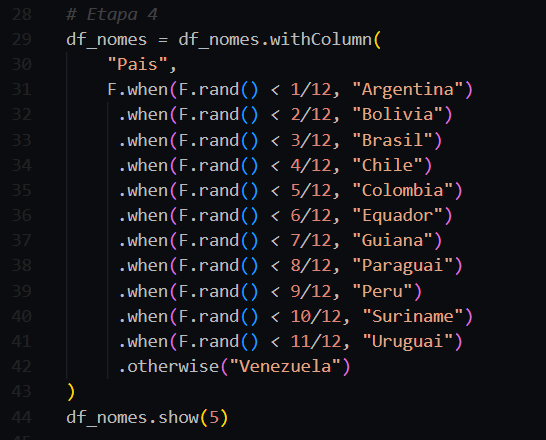  

### Etapa 5
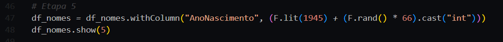  

### Etapa 6
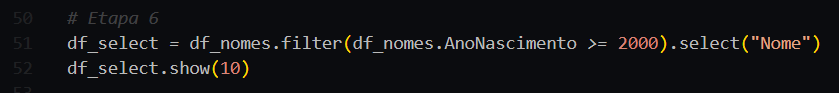  

### Etapa 7
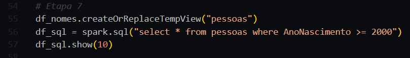  

### Etapa 8
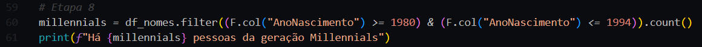  

### Etapa 9
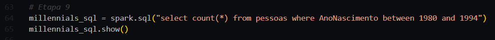  

### Etapa 10
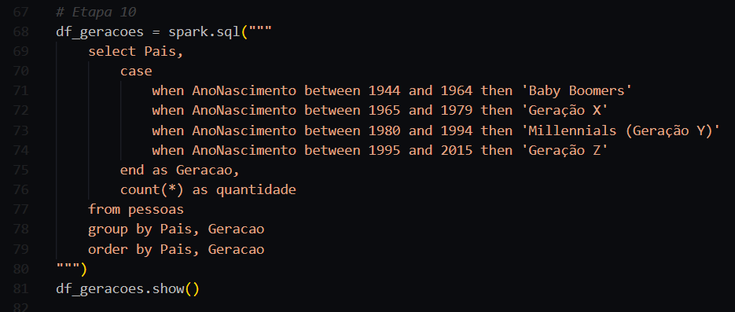  

### Resultado da execução
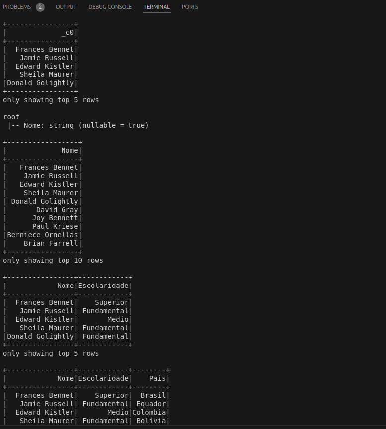  
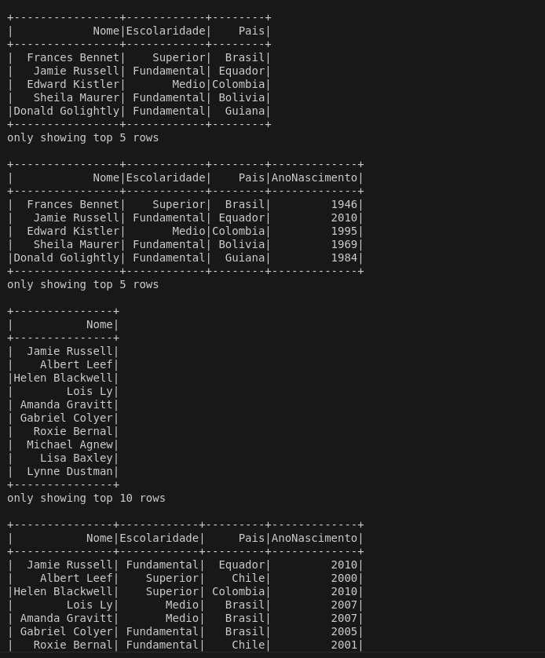  
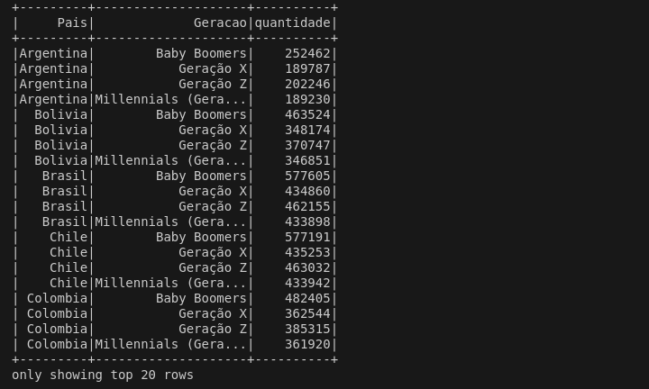

# Certificados

- Data & Analytics - PB - AWS - Novo - 8/10
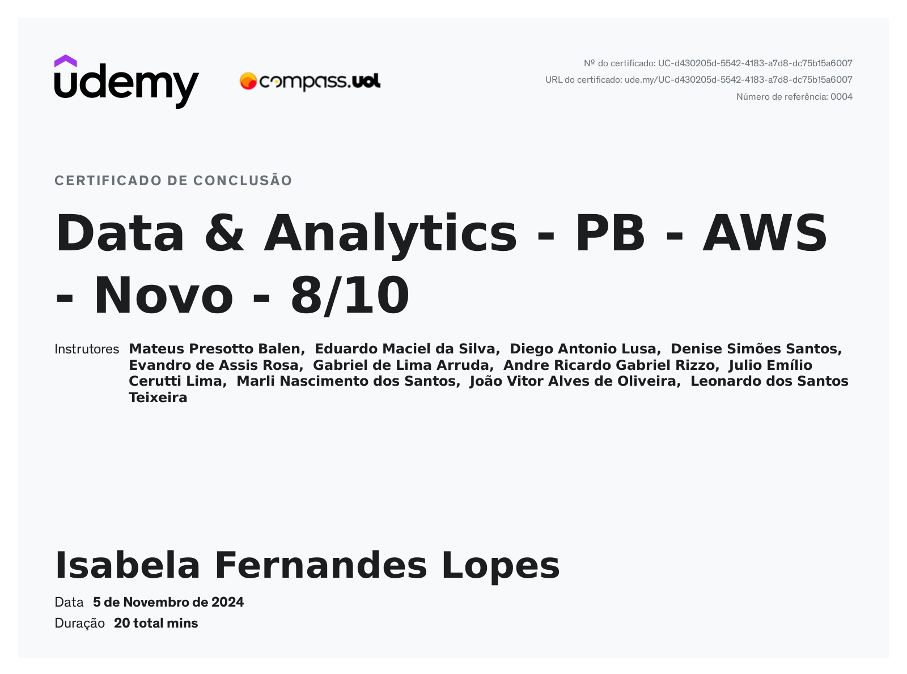  
