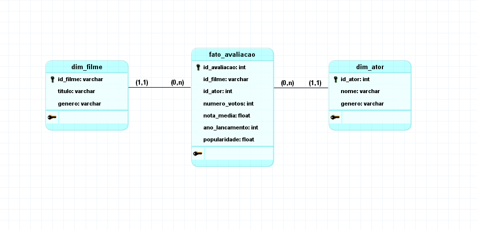
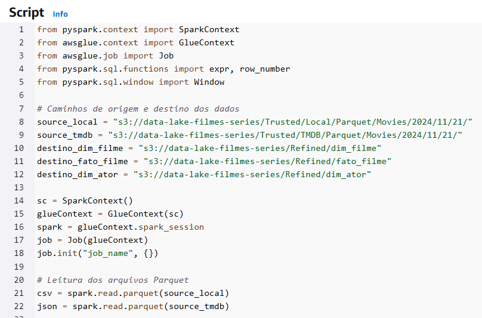
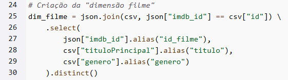
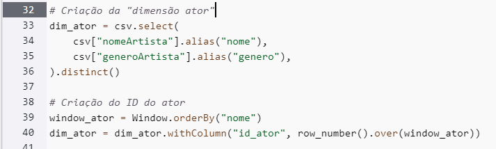
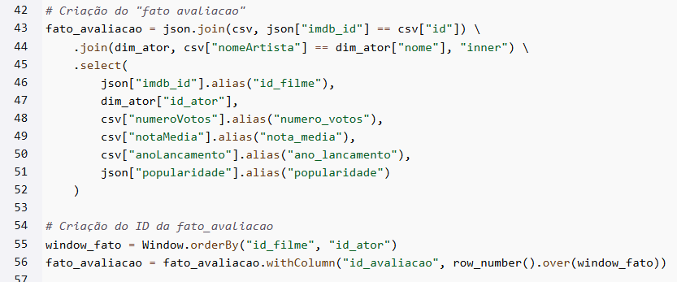
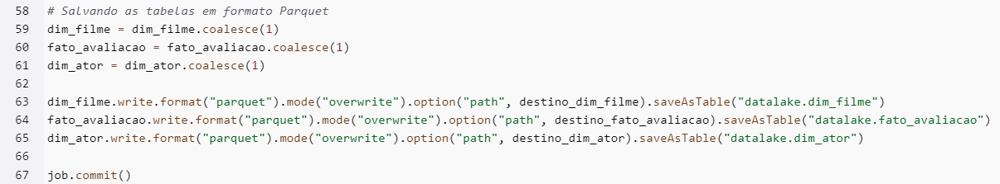
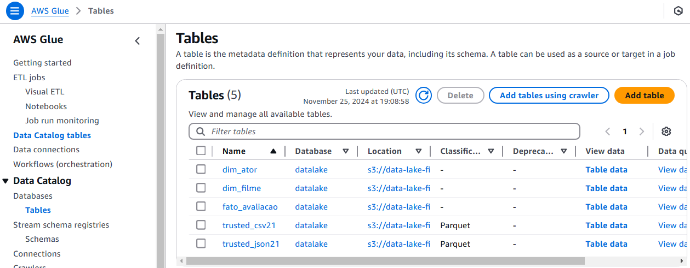
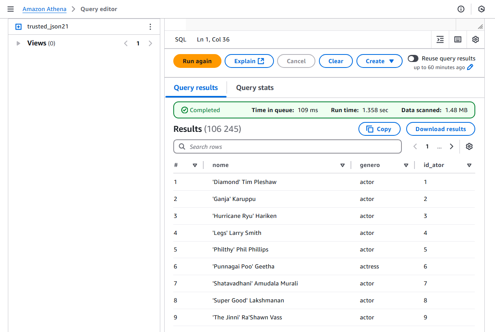
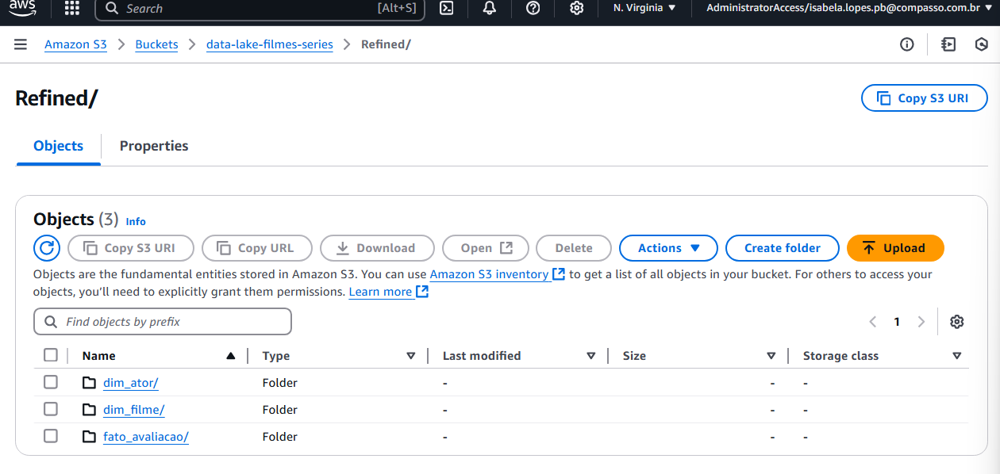

Para iniciar o desafio, o primeiro passo foi realizar a modelagem dimensional. Utilizei o software brModelo para criar as dimensões e a tabela fato, selecionando os atributos que seriam necessários para a minha análise:  
**Popularidade de atores em filmes de comédia/animação com base no número de votos e nota média de filmes lançados a partir de 1990.**  
Com base nisso, criei:
- Dimensão Filme: Contendo informações como título do filme e gênero.
- Dimensão Ator: Com o ID do ator, nome e gênero.
- Tabela Fato - Avaliação: Relacionando os filmes aos atores e armazenando métricas como número de votos, nota média, ano de lançamento e popularidade do filme.

  

Com a modelagem pronta, configurei um Job no AWS Glue seguindo as instruções do desafio. Em seguida, comecei a escrever o script responsável pela criação das tabelas. O código pode ser consultado [aqui](refined.py).  
  
No script, inicializei os contextos Spark e defini os caminhos das fontes de dados (camada Trusted) e dos destinos (camada Refined) para os arquivos no formato Parquet:
  

**Dimensão Filme**
Eu criei a dim_filme unindo dados da API do TMDB e do arquivo CSV. As colunas selecionadas foram:
- imdb_id (API TMDB)  
- tituloPrincipal (CSV)  
- genero (CSV)  
  

**Dimensão Ator**
Para a dim_ator, extraí as colunas:
- nomeArtista (CSV)
- generoArtista (CSV)
Também criei uma nova coluna para gerar IDs únicos para cada ator, garantindo que cada nome tivesse um identificador próprio:
  

Tabela Fato - Avaliação
A fato_avaliacao foi gerada a partir da junção das fontes de dados e das tabelas dimensionais. As colunas incluíram:
- imdb_id (API TMDB)
- popularidade (API TMDB)
- numeroVotos (CSV)
- notaMedia (CSV)
- anoLancamento (CSV)
- id_ator (Dimensão Ator)
Também adicionei uma coluna de identificador único para cada registro:
  

Após a criação das tabelas, salvei os dados no formato Parquet na camada Refined do Data Lake. Além disso, registrei as tabelas no AWS Glue Data Catalog utilizando o método saveAsTable.
  

As tabelas foram registradas e podem ser visualizadas diretamente no AWS Glue Data Catalog:
  

E os dados das tabelas podem ser consultados no serviço Amazon Athena:
  

Dados persistidos no bucket S3 na camada Refined:
  

